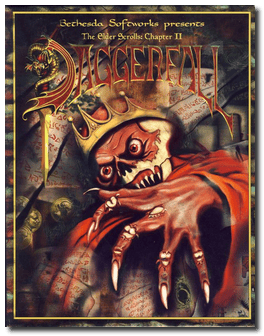
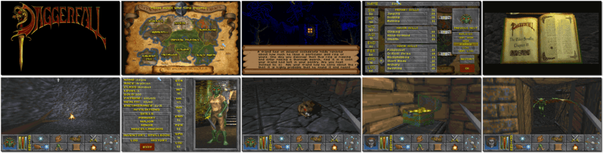

# The Elder Scrolls II: Daggerfall

「**The Elder Scrolls: Chapter Two - Daggerfall**」「**Daggerfall** (Short Name)」

> ❝ The ancient golem Numidium, a powerful weapon once used by the great Tiber Septim to unify Tamriel, has been found in Iliac Bay. The spirit of the murdered King of Daggerfall haunts the kingdom. Emperor Uriel Septim VII sends his champion to the province of High Rock to put the King's ghost to rest and ensure the golem does not fall into the wrong hands. ❞
>
> ❝ In 2009, to commemorate the fifteenth anniversary of the Elder Scrolls franchise, Daggerfall was made free to download from the Bethesda website. ❞ — *Wikipedia*
>

📌 ┃ **Year** ‣ 1996 ┃ **Genre** ‣ Role-playing ┃ **Platform** ‣ DOS ┃ **License** ‣ Freeware ┃ **Media** ‣ CD-ROM ┃ **Patched** ‣ 1.07.213 + Extra quests 

📦 ┃ **[DOSBox](https://www.dosbox.com/) 🟩** ┃ **[DOSBox Staging](https://dosbox-staging.github.io/) 🟩** ┃ **[DOSBox-X](https://dosbox-x.com/) 🟩** 

📎 ┃ **[Wikipedia](https://en.wikipedia.org/wiki/The_Elder_Scrolls_II:_Daggerfall)** ┃ **[MobyGames](https://www.mobygames.com/game/778/the-elder-scrolls-chapter-ii-daggerfall/)** ┃ **[MyAbandonware](https://www.myabandonware.com/game/the-elder-scrolls-chapter-ii-daggerfall-3zw)** ┃ **[Fandom](https://elderscrolls.fandom.com/wiki/The_Elder_Scrolls_II:_Daggerfall)** ┃ **[Series](https://en.wikipedia.org/wiki/The_Elder_Scrolls)** ┃ **[Steam 🆓](https://store.steampowered.com/app/1812390/The_Elder_Scrolls_II_Daggerfall/)** ┃ **[Bethesda](https://elderscrolls.bethesda.net/en/daggerfall)** ┃ **[Unofficial Elder Scrolls Pages](https://en.uesp.net/wiki/Daggerfall:Daggerfall)** 

## Installation Notes
- Change the install size: **Medium installation (95MB)**.
  - Use the default **drive** and **directory** for the installation location.
- Configure sound:
  - Select Digital: **Sound Blaster 16/AWE32**; Port: **220**; DMA: **1**; IRQ: **7**.
  - Select MIDI: **MPU-401**; Port: **330**.
- Proceed with patching the game by pressing `Y` to confirm all the questions.

---

