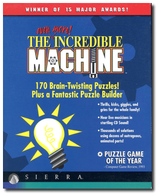
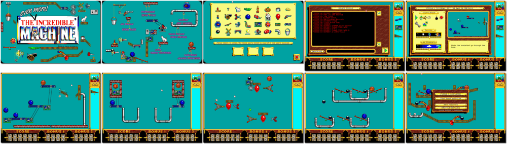

# The Even More! Incredible Machine

「**The Incredible Machine**」

> ❝ It's time to strap on your inventor's helmet, crank up your machine and hang on! Blow up brick walls with bundles of dynamite. Knock bowling bowls onto conveyer belts with spring-loaded boxing gloves. Rummage through 50+ nifty gadgets and wacky devices in the parts bin. You will do a gazillion strange and fun things as you solve the 160 puzzles. ❞
>

📌 ┃ **Year** ‣ 1993 ┃ **Genre** ‣ Puzzle ┃ **Platform** ‣ DOS ┃ **License** ‣ Abandonware ┃ **Category** ‣ Side view ┃ **Media** ‣ Floppy Disk ┃ **Copy Protection** 

📦 ┃ **[DOSBox](https://www.dosbox.com/) 🟩** ┃ **[DOSBox Staging](https://dosbox-staging.github.io/) 🟩** ┃ **[DOSBox-X](https://dosbox-x.com/) 🟩** 

📎 ┃ **[Wikipedia](https://en.wikipedia.org/wiki/The_Incredible_Machine_(1993_video_game))** ┃ **[MobyGames](https://www.mobygames.com/game/3169/the-even-more-incredible-machine/)** ┃ **[AbandonwareDOS](https://www.abandonwaredos.com/abandonware-game.php?abandonware=The+Incredible+Machine&gid=1020)** ┃ **[MyAbandonware](https://www.myabandonware.com/game/the-even-more-incredible-machine-2dh)** ┃ **[Series](https://en.wikipedia.org/wiki/The_Incredible_Machine)** ┃ **Mega Pack** ‣ [GOG 💰](https://www.gog.com/en/game/the_incredible_machine_mega_pack) 

## Installation Notes
- Music: **Sound Blaster / AdLib Card (or compatibles)**.
- Accept these choices and save the configuration.

## Additional Notes
- Consult `Assets/manual.pdf` for the game copy protection.

