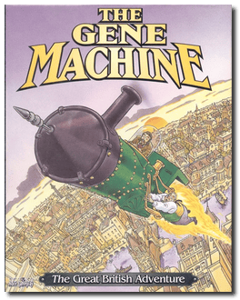
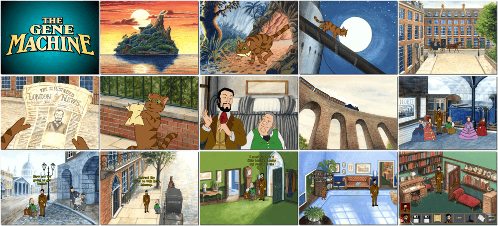

# The Gene Machine

「**The Gene Machine: The Great British Adventure**」

> ❝ It is the age of England. Under the stern rule of Queen Victoria, the British Empire has expanded throughout the globe, bringing the bright light of civilization to the darkest reaches of the wild. Wherever there is poverty and heathen ritual, wherever people drop their H's or don't take afternoon tea, there is at least one garrison of Her Majesty's Army ready to shoot anyone with bare feet. It is a time of adventure and discovery. It is the most exciting of times. Those born to the correct families can look forward to working at the forefront of modern technology as the world succumbs to the power of steam. ❞
>

📌 ┃ **Year** ‣ 1996 ┃ **Genre** ‣ Adventure ┃ **Platform** ‣ DOS ┃ **License** ‣ Abandonware ┃ **Category** ‣ 3rd-person • Graphic adventure • Puzzle elements • Steampunk ┃ **Media** ‣ CD-ROM ┃ **Patched** 

📦 ┃ **[DOSBox](https://www.dosbox.com/) 🟩** ┃ **[DOSBox Staging](https://dosbox-staging.github.io/) 🟩** ┃ **[DOSBox-X](https://dosbox-x.com/) 🟩** 

📎 ┃ **[Wikipedia](https://en.wikipedia.org/wiki/The_Gene_Machine)** ┃ **[MobyGames](https://www.mobygames.com/game/1121/the-gene-machine/)** ┃ **[AbandonwareDOS](https://www.abandonwaredos.com/abandonware-game.php?abandonware=The+Gene+Machine&gid=1635)** ┃ **Manual** ‣ [MyAbandonware](https://www.myabandonware.com/game/the-gene-machine-brm) 

## Installation Notes
- Use the default **drive** and **directory** for the installation location.
- Select and configure MIDI music driver: **Creative Labs Sound Blaster(TM) 16** (*Attempt to configure sound driver automatically*).
- Select and configure digital audio driver: **Creative Labs Sound Blaster 16 or AWE32** (*Attempt to configure sound driver automatically*).

