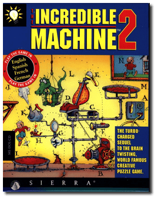
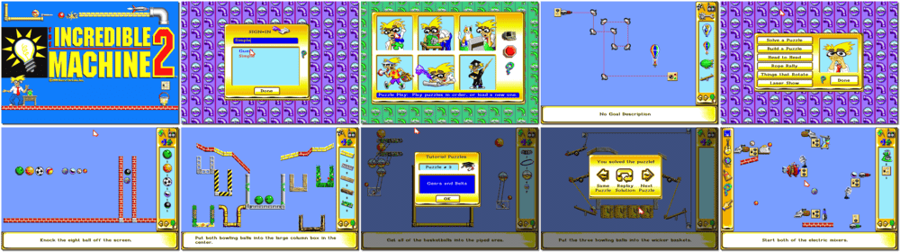

# The Incredible Machine 2

「**The Incredible Machine Version 3.0**」「**Professor Tim's Incredible Machines**」

> ❝ Get ready for more insane, crazy-good fun with the sequel to the award-winning Incredible Machine! Play 150 all-new puzzles in a world where pinwheels and dynamite, cartoon characters and cheese, when manipulating gravity and air pressure to solve fiendishly fun puzzles. A world where you can create complex machines to accomplish seemingly simple tasks. So limber up your brain and prepare to be wowed, stumped and ecstatic all at once. ❞
>

📌 ┃ **Year** ‣ 1995 ┃ **Genre** ‣ Puzzle ┃ **Platform** ‣ DOS ┃ **License** ‣ Abandonware ┃ **Category** ‣ Side view ┃ **Media** ‣ Floppy Disk 

📦 ┃ **[DOSBox](https://www.dosbox.com/)** ‣ 0.74-3 🟥 (error at installation) ┃ **[DOSBox Staging](https://dosbox-staging.github.io/) 🟩** ┃ **[DOSBox-X](https://dosbox-x.com/) 🟩** 

📎 ┃ **[Wikipedia](https://en.wikipedia.org/wiki/The_Incredible_Machine_2)** ┃ **[Wikipedia - The Incredible Machine Series](https://en.wikipedia.org/wiki/The_Incredible_Machine)** ┃ **[MobyGames](https://www.mobygames.com/game/1605/the-incredible-machine-2/)** ┃ **[AbandonwareDOS](https://www.abandonwaredos.com/abandonware-game.php?abandonware=The+Incredible+Machine+2&gid=1906)** ┃ **[MyAbandonware](https://www.myabandonware.com/game/the-incredible-machine-2-1n2)** ┃ **Mega Pack** ‣ [GOG 💰](https://www.gog.com/en/game/the_incredible_machine_mega_pack) 

## Installation Notes
- Music: **Sound Blaster / AdLib Card (or compatibles)**.
- Accept these choices and save the configuration.

