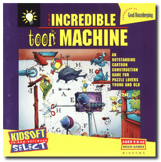
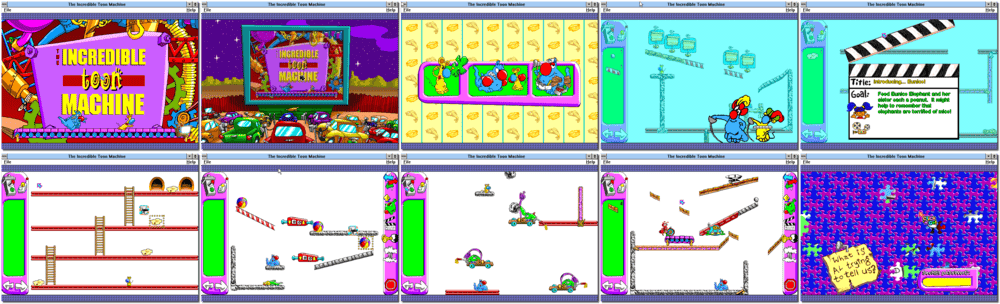

# The Incredible Toon Machine

> ❝ Don't try this stuff at home. These guys are professionals! Drop a piano on Al E. Cat's head! (Konk!) Entice Sid Mouse to sit on hat pins! (Boink!) Smash Al in the foot with a really HUMONGOUS ANVIL! (Crunch!). See the Toons All-Star Pros wince, howl, or get steamed as they chase each other through nearly 100 different slapstick puzzle plots. Plots written and directed by YOU! ❞
>

📌 ┃ **Year** ‣ 1994 ┃ **Genre** ‣ Puzzle ┃ **Platform** ‣ Windows 3.1x ┃ **License** ‣ Abandonware ┃ **Media** ‣ CD-ROM 

📦 ┃ **[DOSBox](https://www.dosbox.com/) 🟩** ┃ **[DOSBox Staging](https://dosbox-staging.github.io/) 🟩** ┃ **[DOSBox-X](https://dosbox-x.com/) 🟩** 

📎 ┃ **[Wikipedia](https://en.wikipedia.org/wiki/The_Incredible_Toon_Machine)** ┃ **[MobyGames](https://www.mobygames.com/game/9601/the-incredible-toon-machine/)** ┃ **[AbandonwareDOS](https://www.abandonwaredos.com/abandonware-game.php?abandonware=The+Incredible+Toon+Machine&gid=2124)** ┃ **Game Manual** ‣ [MyAbandonware](https://www.myabandonware.com/game/the-incredible-toon-machine-3le) ┃ **[Series](https://en.wikipedia.org/wiki/The_Incredible_Machine)** 

## Installation Notes
- Use the default **drive** and **directory** for the installation location.
- Ignore pop-up error: *Setup Initialization Error*. It will not affect gameplay.
- Exit Windows and DOSBox once the installation is complete (**Program Manager > File > Exit Windows**) and rerun the `Launch` script to start the program.

