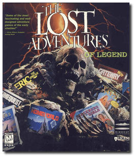
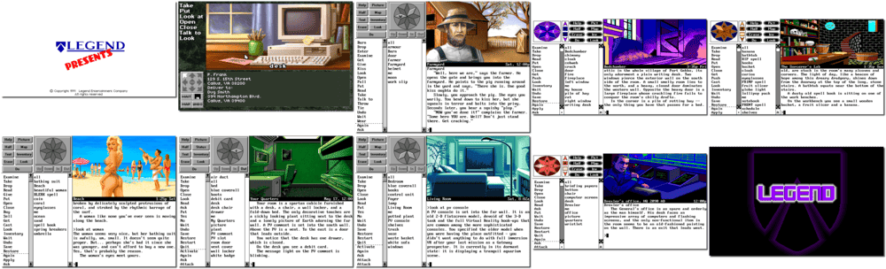

# The Lost Adventures of Legend

「**Companions of Xanth**」「**Eric the Unready**」「**Spellcasting 101: Sorcerers get all the Girls**」「**Spellcasting 201: The Sorcerer's Appliance**」「**Spellcasting 301: Spring Break • Steve Meretzky's Spellcasting 301: Spring Break**」「**Gateway • Frederik Pohl's Gateway**」「**Gateway II: Homeworld**」「**Timequest**」

> ❝ The Lost Adventures is a compilation of eight award-winning adventures spanning the sci-fi, fantasy and comedy categories. ❞
>
> ❝ Besides **Gateway**, all the games in this compilation **are not abandonware 🚫**. Two games, **Companions of Xanth** and **Gateway II: Homeworld**, are no longer available digitally. Other games are available on *GOG 💰* and *Steam 💰* (see below). ❞
>

📌 ┃ **Year** ‣ 1996 ┃ **Year (Companions of Xanth)** ‣ 1993 ┃ **Year (Eric the Unready)** ‣ 1993 ┃ **Year (Spellcasting 101: Sorcerers get all the Girls)** ‣ 1990 ┃ **Year (Spellcasting 201: The Sorcerer's Appliance)** ‣ 1991 ┃ **Year (Spellcasting 301: Spring Break)** ‣ 1992 ┃ **Year (Gateway)** ‣ 1992 ┃ **Year (Gateway II: Homeworld)** ‣ 1993 ┃ **Year (Timequest)** ‣ 1991 ┃ **Genre** ‣ Adventure ┃ **Platform** ‣ DOS ┃ **License** ‣ Proprietary ┃ **License (Gateway)** ‣ Abandonware ┃ **Category (Companions of Xanth)** ‣ 1st-person • Graphic adventure • Puzzle elements • Fantasy • Comedy ┃ **Category (Eric the Unready)** ‣ Interactive fiction • Fantasy • Comedy ┃ **Category (Spellcasting 101: Sorcerers get all the Girls)** ‣ Interactive fiction • Puzzle elements • Fantasy • Adult • Comedy ┃ **Category (Spellcasting 201: The Sorcerer's Appliance)** ‣ Interactive fiction • Puzzle elements • Fantasy • Adult • Comedy ┃ **Category (Spellcasting 301: Spring Break)** ‣ Interactive fiction • Puzzle elements • Fantasy • Adult • Comedy ┃ **Category (Gateway)** ‣ Interactive fiction • Puzzle elements • Sci-fi ┃ **Category (Gateway II: Homeworld)** ‣ Interactive fiction • Puzzle elements • Sci-fi ┃ **Category (Timequest)** ‣ Interactive fiction • Puzzle elements • Sci-fi ┃ **Media** ‣ CD-ROM ┃ **Compilation** 

📦 ┃ **[DOSBox](https://www.dosbox.com/) 🟩** ┃ **[DOSBox Staging](https://dosbox-staging.github.io/) 🟩** ┃ **[DOSBox-X](https://dosbox-x.com/) 🟩** 

📎 ┃ **The Lost Adventures of Legend** ‣ [MobyGames](https://www.mobygames.com/game/1338/the-lost-adventures-of-legend/) ┃ **Companions of Xanth** ‣ [Wikipedia](https://en.wikipedia.org/wiki/Companions_of_Xanth) • [MobyGames](https://www.mobygames.com/game/319/companions-of-xanth/) • [AbandonwareDOS](https://www.abandonwaredos.com/abandonware-game.php?abandonware=Companions+of+Xanth&gid=959) • [MyAbandonware](https://www.myabandonware.com/game/companions-of-xanth-1yy) ┃ **Eric the Unready** ‣ [Wikipedia](https://en.wikipedia.org/wiki/Eric_the_Unready) • [MobyGames](https://www.mobygames.com/game/431/eric-the-unready/) • [AbandonwareDOS](https://www.abandonwaredos.com/abandonware-game.php?abandonware=Eric+the+Unready&gid=1303) • [MyAbandonware](https://www.myabandonware.com/game/eric-the-unready-2nv) • [GOG 💰](https://www.gog.com/en/game/eric_the_unready) • [Steam 💰](https://store.steampowered.com/app/1006450/Eric_The_Unready/) ┃ **Spellcasting 101: Sorcerers get all the Girls** ‣ [Wikipedia](https://en.wikipedia.org/wiki/Spellcasting_101:_Sorcerers_Get_All_the_Girls) • [MobyGames](https://www.mobygames.com/game/1027/spellcasting-101-sorcerers-get-all-the-girls/) • [AbandonwareDOS](https://www.abandonwaredos.com/abandonware-game.php?abandonware=Spellcasting+101%3A+Sorcerers+get+all+the+girls&gid=1257) • [MyAbandonware](https://www.myabandonware.com/game/spellcasting-101-sorcerers-get-all-the-girls-10m) • [GOG 💰](https://www.gog.com/en/game/spellcasting_123) • [Steam 💰](https://store.steampowered.com/app/1028460/Spellcasting_Collection/) ┃ **Spellcasting 201: The Sorcerer's Appliance** ‣ [Wikipedia](https://en.wikipedia.org/wiki/Spellcasting_201:_The_Sorcerer%27s_Appliance) • [MobyGames](https://www.mobygames.com/game/1083/spellcasting-201-the-sorcerers-appliance/) • [AbandonwareDOS](https://www.abandonwaredos.com/abandonware-game.php?abandonware=Spellcasting+201%3A+The+Sorcerer%27s+Appliance&gid=1322) • [MyAbandonware](https://www.myabandonware.com/game/spellcasting-201-the-sorcerer-s-appliance-19l) • [GOG 💰](https://www.gog.com/en/game/spellcasting_123) • [Steam 💰](https://store.steampowered.com/app/1028460/Spellcasting_Collection/) ┃ **Spellcasting 301: Spring Break** ‣ [Wikipedia](https://en.wikipedia.org/wiki/Spellcasting_301:_Spring_Break) • [MobyGames](https://www.mobygames.com/game/1028/steve-meretzkys-spellcasting-301-spring-break/) • [AbandonwareDOS](https://www.abandonwaredos.com/abandonware-game.php?abandonware=Spellcasting+301%3A+Spring+Break&gid=1357) • [MyAbandonware](https://www.myabandonware.com/game/steve-meretzky-s-spellcasting-301-spring-break-1ld) • [GOG 💰](https://www.gog.com/en/game/spellcasting_123) • [Steam 💰](https://store.steampowered.com/app/1028460/Spellcasting_Collection/) ┃ **Gateway** ‣ [Wikipedia](https://en.wikipedia.org/wiki/Gateway_(video_game)) • [MobyGames](https://www.mobygames.com/game/317/frederik-pohls-gateway/) • [AbandonwareDOS](https://www.abandonwaredos.com/abandonware-game.php?abandonware=Frederik+Pohl%27s+Gateway&gid=1361) • [MyAbandonware](https://www.myabandonware.com/game/frederik-pohl-s-gateway-1er) ┃ **Gateway II: Homeworld** ‣ [Wikipedia](https://en.wikipedia.org/wiki/Gateway_II:_Homeworld) • [MobyGames](https://www.mobygames.com/game/318/gateway-ii-homeworld/) • [AbandonwareDOS](https://www.abandonwaredos.com/abandonware-game.php?abandonware=Gateway+2%3A+Homeworld&gid=1829) • [MyAbandonware](https://www.myabandonware.com/game/gateway-ii-homeworld-2a9) ┃ **Timequest** ‣ [Wikipedia](https://en.wikipedia.org/wiki/Timequest) • [MobyGames](https://www.mobygames.com/game/1026/timequest/) • [AbandonwareDOS](https://www.abandonwaredos.com/abandonware-game.php?abandonware=Timequest&gid=2045) • [MyAbandonware](https://www.myabandonware.com/game/timequest-1ac) • [GOG 💰](https://gog.com/en/game/timequest) • [Steam 💰](https://store.steampowered.com/app/1297560/Timequest/) 

## Installation Notes
- Press `ESC` to continue installing all the games.
- Music and Sound Device: **Creative Labs Sound Blaster or compatible**.
- Sound Blaster IRQ: **IRQ 7**.
- Sound Blaster I/O Address: **220H**.
- Use the default **drive** and **directory** for all the installation locations.

