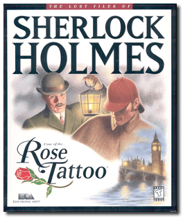

# The Lost Files of Sherlock Holmes: Case of the Rose Tattoo

「**The Lost Files of Sherlock Holmes 2**」「**The Case of the Rose Tattoo**」

> ❝ Test your sleuthing skills as you assume the role of Sherlock Holmes, master detective. An explosion sets off a criminal chain of events - theft, treason, and murder. Thrill to the chase as you investigate a sensitive case, immersing yourself in the sights and sounds of Victorian England. During the investigation, you will unravel heinous crimes, maintain national security, save the government from public ridicule and impeachment, and protect the honour of the Royal family. It's all in a day's work for the world's most famous detective. ❞
>

📌 ┃ **Year** ‣ 1996 ┃ **Genre** ‣ Adventure ┃ **Platform** ‣ DOS ┃ **License** ‣ Abandonware ┃ **Media** ‣ CD-ROM 

📦 ┃ **[DOSBox](https://www.dosbox.com/) 🟩** ┃ **[DOSBox Staging](https://dosbox-staging.github.io/) 🟩** ┃ **[DOSBox-X](https://dosbox-x.com/) 🟩** 

📎 ┃ **[Wikipedia](https://en.wikipedia.org/wiki/The_Lost_Files_of_Sherlock_Holmes:_The_Case_of_the_Rose_Tattoo)** ┃ **[MobyGames](https://www.mobygames.com/game/4407/the-lost-files-of-sherlock-holmes-case-of-the-rose-tattoo/)** ┃ **[MyAbandonware](https://www.myabandonware.com/game/the-lost-files-of-sherlock-holmes-case-of-the-rose-tattoo-cem)** 

## Installation Notes
- Use the default **drive** and **directory** for the installation location.
- Select and configure MIDI music driver: **Creative Labs Sound Blaster(TM) 16** (*Attempt to configure sound driver automatically*).
- Select and configure digital audio driver: **Creative Labs Sound Blaster 16 or AWE32** (*Attempt to configure sound driver automatically*).

---

