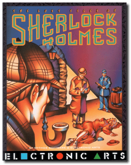
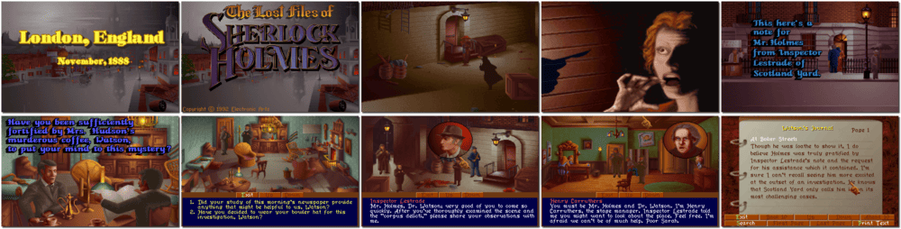

# The Lost Files of Sherlock Holmes: The Case of the Serrated Scalpel

「**The Case of the Serrated Scalpel**」「**The Lost Files of Sherlock Holmes**」

> ❝ London, 1888. Scotland Yard summoned Sherlock Holmes, the world's most famous private investigator, and his faithful companion Dr. Watson to the scene of a gruesome crime - A young actress was found dead in an alley behind her theatre. Not surprisingly, Scotland Yard's Inspector Lestrade is clueless. Was it the work of the Ripper? Sherlock Holmes is unsure, as the circumstantial evidence indicates a much more intricate crime. The shrewd detective begins the hunt. ❞
>

📌 ┃ **Year** ‣ 1992 ┃ **Genre** ‣ Adventure ┃ **Platform** ‣ DOS ┃ **License** ‣ Abandonware ┃ **Category** ‣ 3rd-person • Graphic adventure • Puzzle elements • Detective ┃ **Media** ‣ CD-ROM 

📦 ┃ **[DOSBox](https://www.dosbox.com/) 🟩** ┃ **[DOSBox Staging](https://dosbox-staging.github.io/) 🟩** ┃ **[DOSBox-X](https://dosbox-x.com/) 🟩** 

📎 ┃ **[Wikipedia](https://en.wikipedia.org/wiki/The_Lost_Files_of_Sherlock_Holmes)** ┃ **[MobyGames](https://www.mobygames.com/game/3441/the-lost-files-of-sherlock-holmes/)** ┃ **[AbandonwareDOS](https://www.abandonwaredos.com/abandonware-game.php?abandonware=The+Lost+Files+of+Sherlock+Holmes%3A+The+Case+of+the+Serrated+Scalpel&gid=1678)** ┃ **[MyAbandonware](https://www.myabandonware.com/game/the-lost-files-of-sherlock-holmes-1v4)** 

