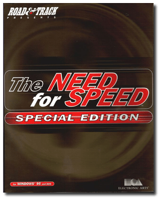
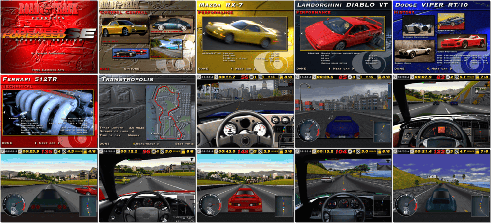

# The Need for Speed: Special Edition

「**Road & Track presents: The Need For Speed - Special Edition**」「**The Need For Speed SE**」

> ❝ Road & Track presents Need for Speed Special Edition with 8 Purebred Exotics: Lamborghini Diablo VT, Chevrolet Corvette ZR-1, Porsche 911 Carrera, Ferrari 512TR, Acura NSX, Mazda RX-7, Dodge Viper RT/10, and Toyota Supra Turbo. ❞
>

📌 ┃ **Year** ‣ 1996 ┃ **Genre** ‣ Racing ┃ **Platform** ‣ DOS ┃ **License** ‣ Abandonware ┃ **Media** ‣ CD-ROM ┃ **Patched** ‣ Video glitch bugfix 

📦 ┃ **[DOSBox](https://www.dosbox.com/) 🟩** ┃ **[DOSBox Staging](https://dosbox-staging.github.io/) 🟩** ┃ **[DOSBox-X](https://dosbox-x.com/) 🟩** 

📎 ┃ **[Wikipedia](https://en.wikipedia.org/wiki/The_Need_for_Speed)** ┃ **[MobyGames](https://www.mobygames.com/game/654/the-need-for-speed-special-edition/)** ┃ **[MyAbandonware](https://www.myabandonware.com/game/the-need-for-speed-special-edition-7q5)** ┃ **[Series](https://en.wikipedia.org/wiki/Need_for_Speed)** 

## Installation Notes
- Sound Card: **Sound Blaster 16/32/AWE 32**.
- Video Test: A minor video test [issue](https://www.os2museum.com/wp/need-for-speed-se-video-glitch/) for **DOSBox** and **DOSBox-X** variants. In-game videos run fine after the patch.
- Install: **Recommended install**.
  - Use the default **drive** and **directory** for the installation location.

---

