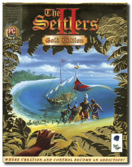
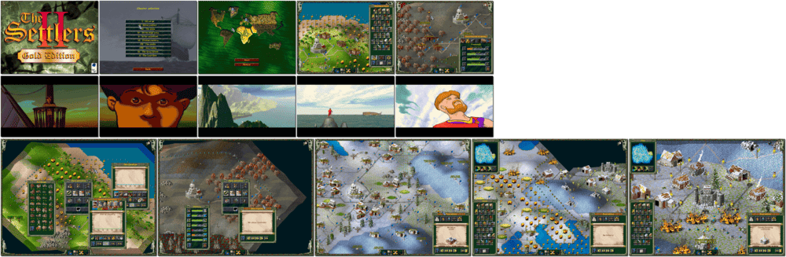

# The Settlers II: Gold Edition

「**The Settlers II**」「**The Settlers II: Veni, Vidi, Vici**」「**Die Siedler II** (German/Original)」

> ❝ The Settler II is a strategy-laden economic simulation and the follow-up to the hugely successful Settlers. Your objective in this highly addictive game is to promote economic growth and prosperity. Your tasks include mining raw materials, farming, hunting, fishing, and expanding borders. You will also be encouraged to trade with the inhabitants of remote islands. ❞
>
> ❝ This game **is not abandonware 🚫** and is part of a **History Collection** edition on [Ubisoft 💰](https://www.ubisoft.com/en-gb/game/the-settlers/history-collection). The **Gold Edition** is also available on [GOG 💰](https://www.gog.com/en/game/the_settlers_2_gold_edition). ❞
>

📌 ┃ **Year** ‣ 1997 ┃ **Genre** ‣ Simulation • Strategy ┃ **Platform** ‣ DOS ┃ **License** ‣ Proprietary ┃ **Category** ‣ Diagonal-down • Real-time • City building • Managerial • Real-time strategy • Classical antiquity ┃ **Media** ‣ CD-ROM 

📦 ┃ **[DOSBox](https://www.dosbox.com/) 🟩** ┃ **[DOSBox Staging](https://dosbox-staging.github.io/) 🟩** ┃ **[DOSBox-X](https://dosbox-x.com/) 🟩** 

📎 ┃ **[Wikipedia](https://en.wikipedia.org/wiki/The_Settlers_II)** ┃ **[MobyGames](https://www.mobygames.com/game/598/the-settlers-ii-veni-vidi-vici/)** ┃ **[MobyGames - Gold Edition](https://www.mobygames.com/game/20461/the-settlers-ii-gold-edition/)** ┃ **[AbandonwareDOS](https://www.abandonwaredos.com/abandonware-game.php?abandonware=The+Settlers+II%3A+Veni%2C+Vidi%2C+Vici&gid=2435)** ┃ **[MyAbandonware](https://www.myabandonware.com/game/the-settlers-ii-veni-vidi-vici-3pv)** ┃ **[MyAbandonware - Gold Edition](https://www.myabandonware.com/game/the-settlers-ii-gold-edition-2ag)** ┃ **[Series](https://en.wikipedia.org/wiki/The_Settlers)** ┃ **[GOG 💰](https://www.gog.com/en/game/the_settlers_2_gold_edition)** ┃ **History Collection** ‣ [Ubisoft 💰](https://www.ubisoft.com/en-gb/game/the-settlers/history-collection) 

## Installation Notes
- Select **Install Settlers II Gold**.
- Use the default **drive** and **directory** for the installation location.
- Setup Sound:
  - Select and configure MIDI music driver: **Creative Labs Sound Blaster(TM) 16** (*Attempt to configure sound driver automatically*).
  - Select and configure digital audio driver: **Creative Labs Sound Blaster 16 or AWE32** (*Attempt to configure sound driver automatically*).
- Change editor-screen-resolution if you're into map editing.

## Additional Notes
- From the in-game *Options* menu, you can change the screen resolution.

