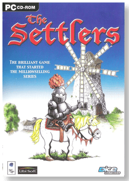

# The Settlers

「**Serf City: Life is Feudal** (Europe)」「**Die Siedler** (Germany/Original)」

> ❝ Have you always wanted to be a boss? Then you should not save until you can afford a mini-state. Let yourself into the world of The Settlers. You alone decide how you shape your empire, how big your settlement will be, and whether you will calmly limit yourself to agriculture, animal husbandry, and fishing; or start the industrial revolution. Your geologists will only be able to tell you where to find ore, coal or gold. It is in your hands to place mines, steel factories and toolmakers, thus stimulating trade within your empire. Have sentry huts, towers or garrisons built to protect yourself from the enemy knights. Gain new lands. Perhaps behind the mountain pass in the north lies a fertile valley where your fishermen can lay out their nets! Listen to the chirping of birds and the rush of the wind, the pounding of the waves and the clash of steel swords. ❞
>
> ❝ This version is the original/legacy release for DOS. This game **is not abandonware 🚫** and is a part of a **History Collection** edition available on [Ubisoft 💰](https://www.ubisoft.com/en-gb/game/the-settlers/history-collection). ❞
>

📌 ┃ Year: **1994** ┃ Genre: **Simulation • Strategy** ┃ Platform: **DOS** ┃ License: **Proprietary** ┃ Category: **Diagonal-down • Real-time • City building • Managerial • Real-time strategy** ┃ Media: **CD-ROM** 

📦 ┃ **[DOSBox](https://www.dosbox.com/) 🟩** ┃ **[DOSBox Staging](https://dosbox-staging.github.io/) 🟩** ┃ **[DOSBox-X](https://dosbox-x.com/) 🟩** 

📎 ┃ **[Wikipedia](https://en.wikipedia.org/wiki/The_Settlers_(1993_video_game))** ┃ **[Wikipedia - The Settlers Series](https://en.wikipedia.org/wiki/The_Settlers)** ┃ **[MobyGames](https://www.mobygames.com/game/425/serf-city-life-is-feudal/)** ┃ **[AbandonwareDOS](https://www.abandonwaredos.com/abandonware-game.php?abandonware=The+Settlers&gid=1858)** ┃ **[MyAbandonware](https://www.myabandonware.com/game/serf-city-life-is-feudal-21o)** ┃ History Collection: **[Ubisoft 💰](https://www.ubisoft.com/en-gb/game/the-settlers/history-collection)** 

## Installation Notes
- Use the default **drive** and **directory** for the installation location.
- Press `1` to **Install**.
- Sound Card Configuration:
  - FM - Music: **Roland MT-32 or compatible with Roland MPU MIDI Interface**. Switch the toggle under the settings to **ON**.
  - FX - Effects: **Creative Labs Sound Blaster(TM) Digital Sound**. Switch the toggle under the settings to **ON**.
  - Select **OK** to quit and save data.
- Press `ESC` to exit the configuration.

## Additional Notes
- You can enable **SVGA Mode** to have better high-resolution graphics by pressing `V`.
- Clicking the left and right mouse buttons simultaneously activates the game **Special Click**.

