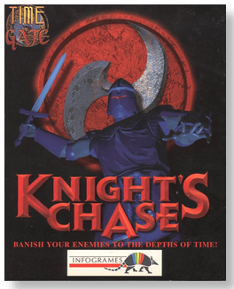
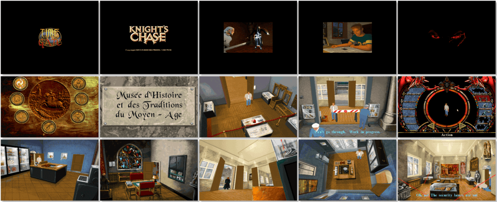

# Time Gate: Knight's Chase

「**Knight's Chase**」

> ❝ Explore the eerie museum of the Middle Ages. Dodge the deadly blows of the grim Black Knights. Rescue your fiancee Juliette from the claws of the Inquisition. Back through time and clash with Wolfram, the lord of the dark forces. But take care! Only one path exists to return to 1995: the TIME GATE. Are you ready to step through the Gates of Time? Will you be able to unravel the secrets of the cursed Order? Can you solve the mystery of the Knights Templar's Treasure? And you, William Tibbs - Are you ready to take up this challenge? ❞
>
> ❝ This game **is not abandonware 🚫** and is still for sale on [GOG 💰](https://www.gog.com/game/time_gate_knights_chase) and [Steam 💰](https://store.steampowered.com/app/781280/Time_Gate_Knights_Chase/). ❞
>

📌 ┃ **Year** ‣ 1995 ┃ **Genre** ‣ Action ┃ **Platform** ‣ DOS ┃ **License** ‣ Proprietary ┃ **Media** ‣ CD-ROM 

📦 ┃ **[DOSBox](https://www.dosbox.com/) 🟩** ┃ **[DOSBox Staging](https://dosbox-staging.github.io/) 🟩** ┃ **[DOSBox-X](https://dosbox-x.com/) 🟩** 

📎 ┃ **[Wikipedia](https://en.wikipedia.org/wiki/Time_Gate:_Knight%27s_Chase)** ┃ **[MobyGames](https://www.mobygames.com/game/4622/time-gate-knights-chase/)** ┃ **[MyAbandonware](https://www.myabandonware.com/game/time-gate-knight-s-chase-32o)** ┃ **[GOG 💰](https://www.gog.com/game/time_gate_knights_chase)** ┃ **[Steam 💰](https://store.steampowered.com/app/781280/Time_Gate_Knights_Chase/)** 

## Installation Notes
- Use the default **drive** and **directory** for the installation location.
- Select **SVGA Full Installation** option.
- Audio configuration:
  - Select Digital: **Sound Blaster 16/AWE32**; Port: **220**; DMA: **1**; IRQ: **7**.
  - Select MIDI: **Sound Blaster 16**; Port: **388**.

---

