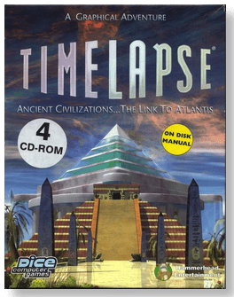
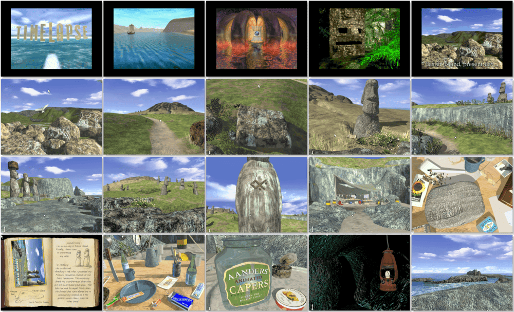

# Timelapse

「**Timelapse: Ancient Civilizations...the Link to Atlantis**」

> ❝ Embark on an adventure through time and space to find a missing archaeologist and discover the alien secret of the fabled sunken lost city of Atlantis and its link to the ancient civilizations of the Egyptians, Maya, Anasazi, and Easter Island. Prepare yourself for the journey as the time gate has re-opened. ❞
>
> ❝ This game **is not abandonware 🚫** and is still for sale on [GOG 💰](http://gog.com/game/timelapse) and [Steam 💰](https://store.steampowered.com/app/433580/Timelapse/). ❞
>

📌 ┃ **Year** ‣ 1996 ┃ **Genre** ‣ Adventure ┃ **Platform** ‣ Windows 3.1x ┃ **License** ‣ Proprietary ┃ **Media** ‣ CD-ROM 

📦 ┃ **[DOSBox](https://www.dosbox.com/)** ‣ 0.74-3 🟥 • Unplayable ┃ **[DOSBox Staging](https://dosbox-staging.github.io/)** ‣ 0.80.1 🟥 • Unplayable ┃ **[DOSBox-X](https://dosbox-x.com/) 🟩** 

📎 ┃ **[Wikipedia](https://en.wikipedia.org/wiki/Timelapse_(video_game))** ┃ **[MobyGames](https://www.mobygames.com/game/2172/timelapse/)** ┃ **[MyAbandonware](https://www.myabandonware.com/game/timelapse-cxs)** ┃ **[GOG 💰](http://gog.com/game/timelapse)** ┃ **[Steam 💰](https://store.steampowered.com/app/433580/Timelapse/)** 

## Installation Notes
- Select **Install TimeLapse**.
- Select **Typical** installation option.
- Use the default **drive** and **directory** for the installation location.
- Confirm the next default settings.
- Uncheck both **I want to view the Release Notes now.** and **I want to play TimeLapse now.** options.
- Exit Windows and DOSBox once the installation is complete (**Program Manager ‣ File ‣ Exit Windows**) and rerun the `Launch` script to start the program.

## Additional Notes
- Mounted CD-ROM images at launch:
  1. Timelapse Disc #1
  2. Timelapse Disc #2
  3. Timelapse Disc #3
  4. Timelapse Disc #4

### How to swap CD-ROM images?
- [DOSBox](https://www.dosbox.com/wiki/DOSBox_FAQ#Swapping_CD_images) — Hotkey: CTRL+F4
- [DOSBox Staging](https://github.com/dosbox-staging/dosbox-staging/blob/main/README) — Hotkey: CTRL+F4 (or CMD+F4 on macOS)
- [DOSBox-X](https://dosbox-x.com/wiki/Guide%3AManaging-image-files-in-DOSBox%E2%80%90X#_mounting_multiple_cd_or_dvd_images) — Hotkey: F11+CTRL+C (or F12+D on macOS). Menu: DOS ‣ Swap CD drive.

---

