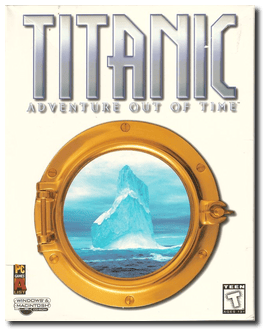
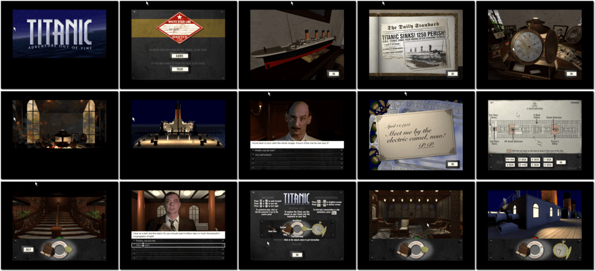

# Titanic: Adventure Out of Time

「**Titanic**」

> ❝ Intrigue and adventure await you on board the Titanic, the most famous ocean liner in history. As a British secret agent on a vital mission, it is up to you to change the course of history as you explore the world’s most luxurious ocean vessel in all its original splendour. Navigate the amazingly detailed 3D reconstruction of the doomed ocean liner and rub elbows with high society from the turn of the century, searching for clues and solving challenging puzzles that could alter world history. Then, on the night of April 14, 1912, you plunge into a race against time. Both spectator and participant in a multi-tiered drama, your survival and the fate of millions hinge on your actions during the last hours of the sinking ocean liner. ❞
>
> ❝ This game **is not abandonware 🚫** and is still for sale on [GOG 💰](https://www.gog.com/en/game/titanic_adventure_out_of_time) and [Steam 💰](https://store.steampowered.com/app/785480/Titanic_Adventure_Out_Of_Time/). ❞
>

📌 ┃ Year: **1996** ┃ Genre: **Adventure** ┃ Platform: **Windows 3.1x** ┃ License: **Proprietary** ┃ Category: **1st-person • Graphic adventure • Puzzle elements • Spy** ┃ Media: **CD-ROM** 

📦 ┃ [DOSBox](https://www.dosbox.com/): **0.74-3 🟥 (unplayable)** ┃ [DOSBox Staging](https://dosbox-staging.github.io/): **0.80.1 🟥 (unplayable)** ┃ **[DOSBox-X](https://dosbox-x.com/) 🟩** 

📎 ┃ **[Wikipedia](https://en.wikipedia.org/wiki/Titanic:_Adventure_Out_of_Time)** ┃ **[MobyGames](https://www.mobygames.com/game/2892/titanic-adventure-out-of-time/)** ┃ **[MyAbandonware](https://www.myabandonware.com/game/titanic-adventure-out-of-time-3rg)** ┃ **[GOG 💰](https://www.gog.com/en/game/titanic_adventure_out_of_time)** ┃ **[Steam 💰](https://store.steampowered.com/app/785480/Titanic_Adventure_Out_Of_Time/)** 

## Installation Notes
- Select **Install Titanic**.
- Select **Typical** installation option.
- Use the default **drive** and **directory** for the installation location.
- Confirm the next default settings.
- Uncheck both **I want to view the Release Notes now.** and **I want to play Titanic now.** options.
- Exit Windows and DOSBox once the installation is complete (**Program Manager > File > Exit Windows**) and rerun the `Launch` script to start the program.

## Additional Notes
- Mounted CD-ROM images at launch:
  1. Titanic: Adventure Out of Time Disc #1
  2. Titanic: Adventure Out of Time Disc #2

### How to swap CD-ROM images?
- [DOSBox](https://www.dosbox.com/wiki/DOSBox_FAQ#Swapping_CD_images) — Hotkey: CTRL+F4
- [DOSBox Staging](https://github.com/dosbox-staging/dosbox-staging/blob/main/README) — Hotkey: CTRL+F4 (or CMD+F4 on macOS)
- [DOSBox-X](https://dosbox-x.com/wiki/Guide%3AManaging-image-files-in-DOSBox%E2%80%90X#_mounting_multiple_cd_or_dvd_images) — Hotkey: F11+CTRL+C (or F12+D on macOS). Menu: DOS > Swap CD drive.

