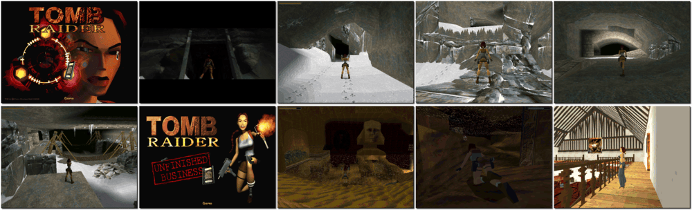

# Tomb Raider Gold

「**Tomb Raider 1**」「**Tomb Raider: Unfinished Business**」「**Tomb Raider featuring Lara Croft**」

> ❝ Adventurer Lara Croft is on a quest to recover the pieces of an ancient artifact known as the Scion. With her fearless acrobatic style, she runs, jumps, swims and climbs her way toward the truth of its origins and powers - leaving only a trail of empty tombs and gun cartridges in her wake. Get ready to cross the globe and take on impossible odds while exploring Incan ruins, Ancient Rome, Egyptian Pyramids, and the Lost City of Atlantis in search of the fabled Scion. ❞
>
> ❝ This game **is not abandonware 🚫** and **Tomb Raider 1+2+3** release is available on [GOG 💰](https://www.gog.com/en/game/tomb_raider_123). **Tomb Raider I** is also available on [Steam 💰](https://store.steampowered.com/app/224960/Tomb_Raider_I/). ❞
>

📌 ┃ **Year** ‣ 1998 ┃ **Genre** ‣ Action ┃ **Platform** ‣ DOS ┃ **License** ‣ Proprietary ┃ **Category** ‣ Behind view • Platform • Puzzle elements • Africa • Europe • South America ┃ **Media** ‣ CD-ROM ┃ **Add-on** 

📦 ┃ **[DOSBox](https://www.dosbox.com/) 🟩** ┃ **[DOSBox Staging](https://dosbox-staging.github.io/) 🟩** ┃ **[DOSBox-X](https://dosbox-x.com/) 🟩** 

📎 ┃ **[Wikipedia](https://en.wikipedia.org/wiki/Tomb_Raider_(1996_video_game))** ┃ **[Wikipedia - Tomb Raider Series](https://en.wikipedia.org/wiki/Tomb_Raider)** ┃ **[MobyGames](https://www.mobygames.com/game/1601/tomb-raider-gold/)** ┃ **[AbandonwareDOS](https://www.abandonwaredos.com/abandonware-game.php?abandonware=Tomb+Raider&gid=1523)** ┃ **[MyAbandonware](https://www.myabandonware.com/game/tomb-raider-d7x)** ┃ **[Tomb Raider Fandom](https://tombraider.fandom.com/wiki/Tomb_Raider_(1996_Game))** ┃ **Tomb Raider 1+2+3** ‣ [GOG 💰](https://www.gog.com/en/game/tomb_raider_123) ┃ **[Steam 💰](https://store.steampowered.com/app/224960/Tomb_Raider_I/)** 

## Installation Notes
- Installing **Tomb Raider**:
  - Use the default **drive** and **directory** for the installation location.
  - Sound Card Setup: Select **Auto Detect**, **Test**, and **Continue**.
  - Complete Setup: Select **Save Settings**.
- Installing **Tomb Raider: Unfinished Business**:
  - Use the default **drive** and **directory** for the installation location.
  - Sound Card Setup: Select **Auto Detect**, **Test**, and **Continue**.
  - Complete Setup: Select **Save Settings**.

## Additional Notes
- CD-ROM images will be mounted based on the selected game:
  1. Tomb Raider
  2. Tomb Raider: Unfinished Business

