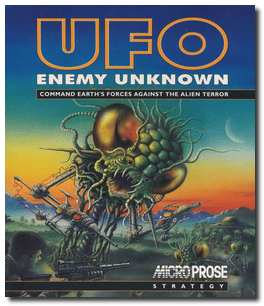
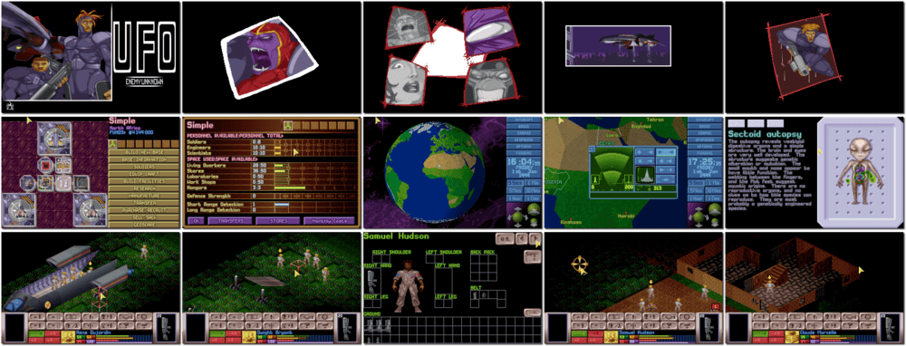

# UFO: Enemy Unknown

「**X-COM: UFO Defense** (North American)」「**X-COM: Terran Defense Force**」

> ❝ You control XCom, an organisation formed by the world's governments to fight the ever-increasing alien menace. Shooting down UFOs is just the beginning. You lead a squad of heavily-armed soldiers across different terrains as they investigate the UFO crash site. Tackle the aliens with automatic rifles, rocket launchers and even tanks in the struggle to retrieve useful technology, weapons or life forms. Successful ground assault missions will allow XCom scientists to analyse alien items. Each breakthrough brings you closer to understanding the technology and culture of the alien races. When your engineers have amassed sufficient research data on their superior weapons and craft, they'll be available for your troops. ❞
>
> ❝ This game **is not abandonware 🚫** and is still for sale on [GOG 💰](https://www.gog.com/en/game/xcom_ufo_defense) and [Steam 💰](https://store.steampowered.com/app/7760/XCOM_UFO_Defense/). ❞
>

📌 ┃ Year: **1994** ┃ Genre: **Strategy** ┃ Platform: **DOS** ┃ License: **Proprietary** ┃ Category: **Diagonal-down • Turn-based • RPG elements • Turn-based strategy • Sci-fi** ┃ Media: **CD-ROM** ┃ **Patched** 

📦 ┃ **[DOSBox](https://www.dosbox.com/) 🟩** ┃ **[DOSBox Staging](https://dosbox-staging.github.io/) 🟩** ┃ **[DOSBox-X](https://dosbox-x.com/) 🟩** 

📎 ┃ **[Wikipedia](https://en.wikipedia.org/wiki/X-COM:_UFO_Defense)** ┃ **[Wikipedia - XCOM Series](https://en.wikipedia.org/wiki/XCOM)** ┃ **[MobyGames](https://www.mobygames.com/game/521/x-com-ufo-defense/)** ┃ **[AbandonwareDOS](https://www.abandonwaredos.com/abandonware-game.php?abandonware=X-COM%3A+Ufo+Defense&gid=1404)** ┃ **[MyAbandonware](https://www.myabandonware.com/game/x-com-ufo-defense-1pl)** ┃ **[GOG 💰](https://www.gog.com/en/game/xcom_ufo_defense)** ┃ **[Steam 💰](https://store.steampowered.com/app/7760/XCOM_UFO_Defense/)** 

## Installation Notes
- Choose Sound FX Board: **SoundBlaster 16**; Base Port: **220**; Irq: **7**; Dma: **1**; Sound Channels: **4**.
- Choose Music Board: **AdLib/SoundBlaster FM**.

