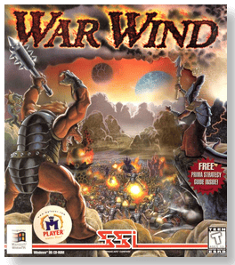
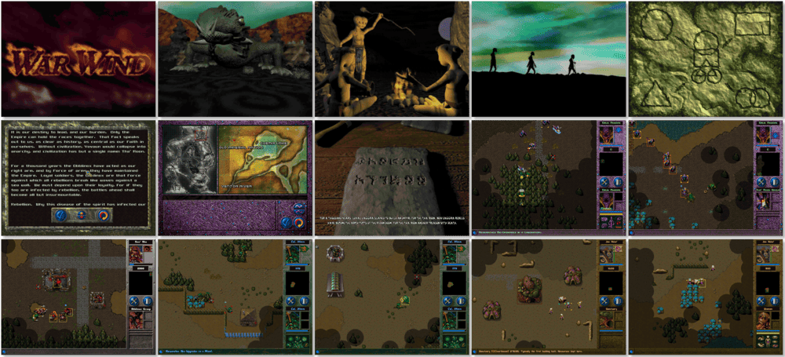

# War Wind

> ❝ Centuries of oppression have plagued the ancient world of Yavaun, and the time has come to put the tyranny to an end! Four unique races inhabit this war-torn alien world, each with its strengths, weaknesses and distinctive A.I. You will experience their epic struggle first-hand. Learn about each race's plight through dozens of spell-binding 3D cinematics and pledge your allegiance to the mentally astute Tha'Roon, the combat-driven Obblinox, the industrious Eaggra, or the mystical Shama'Li. ❞
>
> ❝ War Wind went permanently free on [GOG 🆓](https://www.gog.com/game/war_wind) on June 3, 2020. War Wind was released as a free game on [Steam 🆓](https://store.steampowered.com/app/1741140/War_Wind/) on September 16, 2021. ❞ — *Wikipedia*
>

📌 ┃ **Year** ‣ 1996 ┃ **Genre** ‣ Strategy ┃ **Platform** ‣ Windows 9x ┃ **License** ‣ Freeware ┃ **Media** ‣ CD-ROM ┃ **Patched** ‣ 1.2 

📦 ┃ **[DOSBox](https://www.dosbox.com/) ⬜ • Untested** ┃ **[DOSBox Staging](https://dosbox-staging.github.io/) ⬜ • Untested** ┃ **[DOSBox-X](https://dosbox-x.com/) 🟩** 

📎 ┃ **[Wikipedia](https://en.wikipedia.org/wiki/War_Wind)** ┃ **[MobyGames](https://www.mobygames.com/game/6012/war-wind/)** ┃ **Manual** ‣ [MyAbandonware 📄](https://www.myabandonware.com/game/war-wind-47j) ┃ **[GOG 🆓](https://www.gog.com/game/war_wind)** ┃ **[Steam 🆓](https://store.steampowered.com/app/1741140/War_Wind/)** 

## Installation Notes
- Open *My Computer* and double-click on the `D:` CD-ROM drive to start the installation.
- Select the **Typical** setup option.
- Use the default **drive** and **directory** for the installation location.
- **DO NOT** install *DirectX* or *Direct Media* when prompted.
- Applying patches:
  - A patch is available on `C:\PATCH\PATCH.ZIP`. Extract the compressed file and copy `WW.EXE` to `C:\Program Files\WarWind` override existing file.

---

