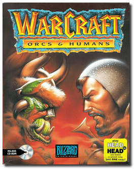
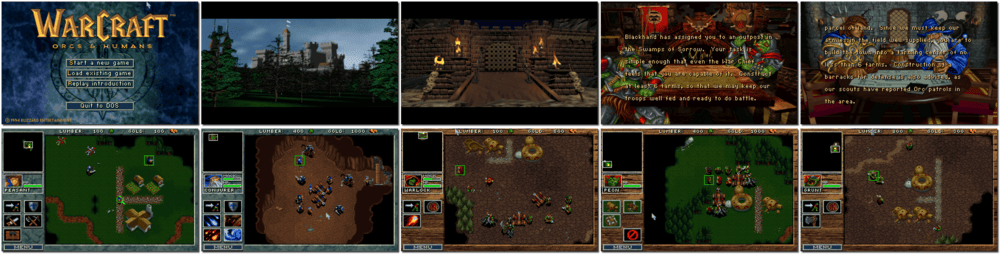

# Warcraft: Orcs & Humans

「**Warcraft**」

> ❝ Enter the world of WarCraft, a mystical land where evil orcs and noble humans battle for survival and domination. With weaponry and powerful magic, these two forces collide in a contest of cunning, intellect, and brute strength. Destroy the orcish hordes or crush the weakling humans. The choice is yours. ❞
>
> ❝ This game **is not abandonware 🚫** and is still for sale on [GOG 💰](https://www.gog.com/en/game/warcraft_orcs_and_humans). ❞
>

📌 ┃ **Year** ‣ 1994 ┃ **Genre** ‣ Strategy ┃ **Platform** ‣ DOS ┃ **License** ‣ Proprietary ┃ **Category** ‣ Top-down • Real-time • Real-time strategy • Fantasy • War ┃ **Media** ‣ CD-ROM 

📦 ┃ **[DOSBox](https://www.dosbox.com/) 🟩** ┃ **[DOSBox Staging](https://dosbox-staging.github.io/) 🟩** ┃ **[DOSBox-X](https://dosbox-x.com/) 🟩** 

📎 ┃ **[Wikipedia](https://en.wikipedia.org/wiki/Warcraft:_Orcs_%26_Humans)** ┃ **[Wikipedia - Warcraft Series](https://en.wikipedia.org/wiki/Warcraft)** ┃ **[MobyGames](https://www.mobygames.com/game/371/warcraft-orcs-humans/)** ┃ **[AbandonwareDOS](https://www.abandonwaredos.com/abandonware-game.php?abandonware=Warcraft%3A+Orcs+and+Humans&gid=1279)** ┃ **[MyAbandonware](https://www.myabandonware.com/game/warcraft-orcs-humans-250)** ┃ **[Warcraft Fandom](https://wowpedia.fandom.com/wiki/Warcraft:_Orcs_%26_Humans)** ┃ **[GOG 💰](https://www.gog.com/en/game/warcraft_orcs_and_humans)** 

## Installation Notes
- Select **FULL -- program + data + moviews on hard disk**.
- Use the default **drive** and **directory** for the installation location.
- Main Menu:
  - Select digitized sound card: **Sound Blaster 16/AWE**; **Auto - detect**.
  - Select music sound card: **Sound Blaster Pro II / SB 16**; **Auto - detect**.

