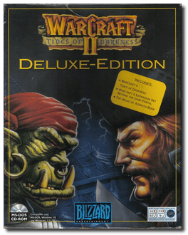
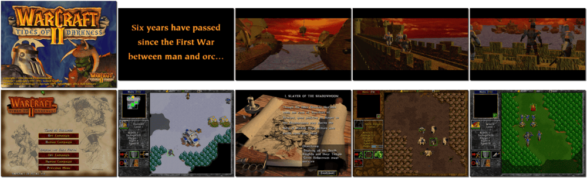

# Warcraft II: Battle Chest

「**Warcraft II: Tides of Darkness**」「**Warcraft II: Beyond the Dark Portal**」「**Warcraft 2**」

> ❝ Return to the World of Warcraft, where the battle between the evil Orcs and the noble Humans rages on. With powerful new allies, terrifying creatures and ingenious weaponry, the struggle for the domination of Azeroth continues. ❞ — *Warcraft II: Tides of Darkness*
>
> ❝ After destroying the mystic gate into Azeroth, the Humans discover that the rift which allows the Orcs passage into their world still exists. Human forces must now venture beyond the Dark Portal into Orcish lands to end the threat of yet another invasion by the hordes. ❞ — *Warcraft II: Beyond the Dark Portal*
>
> ❝ This game **is not abandonware 🚫** and **Battle.net Edition** release is available on [GOG 💰](https://www.gog.com/en/game/warcraft_2_battlenet_edition). ❞
>

📌 ┃ **Year** ‣ 1995 ┃ **Year (Beyond the Dark Portal)** ‣ 1996 ┃ **Genre** ‣ Strategy ┃ **Platform** ‣ DOS ┃ **License** ‣ Proprietary ┃ **Category** ‣ Top-down • Real-time • Real-time strategy • Fantasy • Steampunk • War ┃ **Media** ‣ CD-ROM ┃ **Compilation** 

📦 ┃ **[DOSBox](https://www.dosbox.com/) 🟩** ┃ **[DOSBox Staging](https://dosbox-staging.github.io/) 🟩** ┃ **[DOSBox-X](https://dosbox-x.com/) 🟩** 

📎 ┃ **Warcraft II: Tides of Darkness** ‣ [Wikipedia](https://en.wikipedia.org/wiki/Warcraft_II:_Tides_of_Darkness) • [MobyGames](https://www.mobygames.com/game/1339/warcraft-ii-tides-of-darkness/) • [AbandonwareDOS](https://www.abandonwaredos.com/abandonware-game.php?abandonware=Warcraft+2%3A+Tides+of+Darkness&gid=1786) • [MyAbandonware](https://www.myabandonware.com/game/warcraft-ii-tides-of-darkness-2sh) • [Warcraft Fandom](https://wowpedia.fandom.com/wiki/Warcraft_II:_Tides_of_Darkness) ┃ **Warcraft II: Beyond the Dark Portal** ‣ [Wikipedia](https://en.wikipedia.org/wiki/Warcraft_II:_Beyond_the_Dark_Portal) • [MobyGames](https://www.mobygames.com/game/1377/warcraft-ii-beyond-the-dark-portal/) • [MyAbandonware](https://www.myabandonware.com/game/warcraft-ii-beyond-the-dark-portal-4a5) • [Warcraft Fandom](https://wowpedia.fandom.com/wiki/Warcraft_II:_Beyond_the_Dark_Portal) ┃ **[Wikipedia - Warcraft Series](https://en.wikipedia.org/wiki/Warcraft)** ┃ **Battle.net Edition** ‣ [GOG 💰](https://www.gog.com/en/game/warcraft_2_battlenet_edition) 

## Installation Notes
- Installing Warcraft II: Tides of Darkness
  - Use the default **drive** and **directory** for the installation location.
  - Please select a digital driver: Confirm **Autodetect** and then **Auto Set**. Feel free to **Test**.
  - Please select a music driver: Confirm **Autodetect** and then **Auto Set**. Feel free to **Test**.
  - Select **OK** to complete the installation.
- Installing Warcraft II: Beyond the Dark Portal
  - Use the default **drive** and **directory** for the installation location.

## Additional Notes
- Mounted CD-ROM images at launch:
  1. Warcraft II: Tides of Darkness
  2. Warcraft II: Beyond the Dark Portal

### How to swap CD-ROM images?
- [DOSBox](https://www.dosbox.com/wiki/DOSBox_FAQ#Swapping_CD_images) — Hotkey: CTRL+F4
- [DOSBox Staging](https://github.com/dosbox-staging/dosbox-staging/blob/main/README) — Hotkey: CTRL+F4 (or CMD+F4 on macOS)
- [DOSBox-X](https://dosbox-x.com/wiki/Guide%3AManaging-image-files-in-DOSBox%E2%80%90X#_mounting_multiple_cd_or_dvd_images) — Hotkey: F11+CTRL+C (or F12+D on macOS). Menu: DOS > Swap CD drive.

