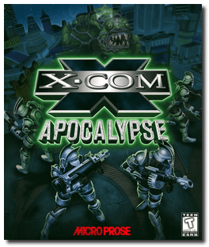
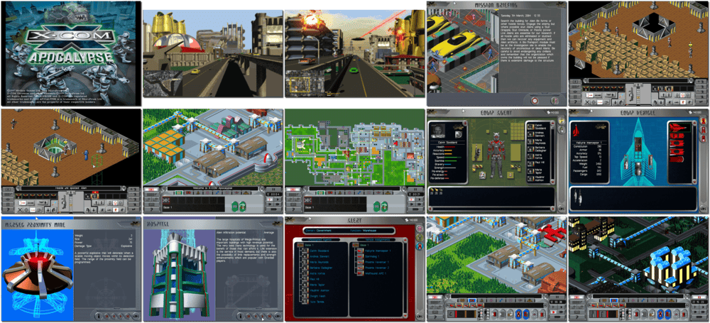

# X-COM: Apocalypse

> ❝ Human excess, petty conflict, and alien invasion have ravaged the Earth. The world's population has merged into huge cities, the first of which was Mega Primus. In 2084, a Utopia shattered, social collapse and civil unrest reigned in Mega Primus. Fiendish aliens terrorize the city. UFOs swarm through Dimensional Gateways. The city is under siege from an unknown enemy. As an X-COM Commander, your mission is to combat alien aggression and uncover their deadly intentions. But Beware! Alien infiltration into the city and its politics could see you under fire from criminal gangs, religious sects, and even the police! ❞
>
> ❝ This game **is not abandonware 🚫** and is still for sale on [GOG 💰](https://www.gog.com/en/game/xcom_apocalypse) and [Steam 💰](https://store.steampowered.com/app/7660/XCOM_Apocalypse/). ❞
>

📌 ┃ **Year** ‣ 1997 ┃ **Genre** ‣ Strategy ┃ **Platform** ‣ DOS ┃ **License** ‣ Proprietary ┃ **Category** ‣ Diagonal-down • Real-time • Turn-based • Sci-fi ┃ **Media** ‣ CD-ROM 

📦 ┃ **[DOSBox](https://www.dosbox.com/) 🟩** ┃ **[DOSBox Staging](https://dosbox-staging.github.io/) 🟩** ┃ **[DOSBox-X](https://dosbox-x.com/) 🟩** 

📎 ┃ **[Wikipedia](https://en.wikipedia.org/wiki/X-COM:_Apocalypse)** ┃ **[MobyGames](https://www.mobygames.com/game/349/x-com-apocalypse/)** ┃ **[AbandonwareDOS](https://www.abandonwaredos.com/abandonware-game.php?abandonware=X-COM%3A+Apocalypse&gid=2178)** ┃ **[MyAbandonware](https://www.myabandonware.com/game/x-com-apocalypse-cxz)** ┃ **[Series](https://en.wikipedia.org/wiki/XCOM)** ┃ **[GOG 💰](https://www.gog.com/en/game/xcom_apocalypse)** ┃ **[Steam 💰](https://store.steampowered.com/app/7660/XCOM_Apocalypse/)** 

## Installation Notes
- Select **I Accept** to the Software License Agreement.
- Select **Install Game**.
- Select **Install optimal version**.
- Installer hardware requirements may report *slow CD-ROM speed*. Ignore this.
- Use the default **drive** and **directory** for the installation location.
- Select **Set up sound card**:
  - Set Sound Device: **SoundBlaster 16/AWE32**; Set Port: **220**; Set IRQ: **7**; Set DMA: **5**.
- Select **Exit and save configuration**.

