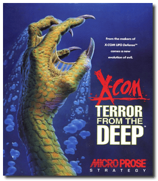
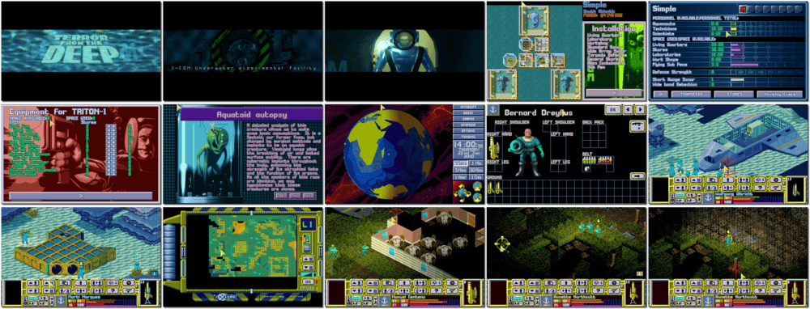

# X-COM: Terror from the Deep

「**X-COM 2**」「**UFO 2**」「**TFTD**」

> ❝ Awakened by the cosmic emissions of their brothers, the vast chambers of innumerable species begin their re-animation cycle. XCom must face a new terror, an army of aliens but in an environment more deadly than deep space. The aliens of the depths are well prepared to take on men in all the oceans, even bringing the war onto the land. Enter into combat in a strange and alien world and use new technology. Arm your troops for an encounter the likes of man has only dreamed of in his worst nightmares. A vast sleeping enemy has awoken. When the vessel T'leth crash-landed on Earth some sixty-five million years ago, the emergency systems placed the aliens in suspended animation. A distress call was sent but never received by the alien's homeworld. Over the eons, computers have awoken small groups of aliens to attempt colonisation, but the strategies and devices have been imperfect. They have also been sinking ships over the centuries to plunder their cargoes and recover gold - the base metal in the hyper-alloy Zrbite. ❞
>
> ❝ This game **is not abandonware 🚫** and is still for sale on [GOG 💰](https://www.gog.com/en/game/xcom_terror_from_the_deep) and [Steam 💰](https://store.steampowered.com/app/7650/XCOM_Terror_From_the_Deep/). ❞
>

📌 ┃ Year: **1995** ┃ Genre: **Strategy** ┃ Platform: **DOS** ┃ License: **Proprietary** ┃ Category: **Diagonal-down • Turn-based • Turn-based strategy • Sci-fi • War** ┃ Media: **CD-ROM** ┃ **Patched** 

📦 ┃ **[DOSBox](https://www.dosbox.com/) 🟩** ┃ **[DOSBox Staging](https://dosbox-staging.github.io/) 🟩** ┃ **[DOSBox-X](https://dosbox-x.com/) 🟩** 

📎 ┃ **[Wikipedia](https://en.wikipedia.org/wiki/X-COM:_Terror_from_the_Deep)** ┃ **[Wikipedia - XCOM Series](https://en.wikipedia.org/wiki/XCOM)** ┃ **[MobyGames](https://www.mobygames.com/game/543/x-com-terror-from-the-deep/)** ┃ **[AbandonwareDOS](https://www.abandonwaredos.com/abandonware-game.php?abandonware=X-COM%3A+Terror+from+the+Deep&gid=1531)** ┃ **[MyAbandonware](https://www.myabandonware.com/game/x-com-terror-from-the-deep-1pk)** ┃ **[GOG 💰](https://www.gog.com/en/game/xcom_terror_from_the_deep)** ┃ **[Steam 💰](https://store.steampowered.com/app/7650/XCOM_Terror_From_the_Deep/)** 

## Installation Notes
- Use the default **drive** and **directory** for the installation location.
- Choose Sound FX Board: **SoundBlaster 16**; Base Port: **220**; Irq: **7**; Dma: **1**; Sound Channels: **4**.
- Choose Music Board: **AdLib/SoundBlaster FM**.

