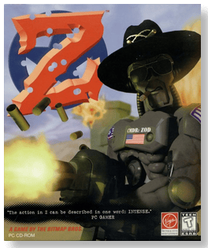

# Z

> ❝ Z is a riotous race for supremacy between armies of space-faring robots. Your one aim in life as the commander of your forces is to conquer planets and wipe out the enemy forces. You’ll have to take charge of your robot units and direct them in battle. The action is fast and furious. Be prepared to make life-and-death decisions on the spur of the moment. Remember, in Z, if you hesitate, you’ve had it! ❞
>
> ❝ This game **is not abandonware 🚫** and is still for sale on [GOG 💰](https://www.gog.com/en/game/z), [Steam 💰](https://store.steampowered.com/app/275530/Z/), and [Zoom 💰](https://www.zoom-platform.com/product/z-the-game). ❞
>

📌 ┃ **Year** ‣ 1996 ┃ **Genre** ‣ Strategy ┃ **Platform** ‣ DOS ┃ **License** ‣ Proprietary ┃ **Media** ‣ CD-ROM 

📦 ┃ **[DOSBox](https://www.dosbox.com/) 🟩** ┃ **[DOSBox Staging](https://dosbox-staging.github.io/) 🟩** ┃ **[DOSBox-X](https://dosbox-x.com/) 🟩** 

📎 ┃ **[Wikipedia](https://en.wikipedia.org/wiki/Z_(video_game))** ┃ **[MobyGames](https://www.mobygames.com/game/346/z/)** ┃ **[MyAbandonware](https://www.myabandonware.com/game/z-2uk)** ┃ **[GOG 💰](https://www.gog.com/en/game/z)** ┃ **[Steam 💰](https://store.steampowered.com/app/275530/Z/)** ┃ **[Zoom 💰](https://www.zoom-platform.com/product/z-the-game)** 

## Installation Notes
- Please select an option: **Install Z**.
- Use the default **drive** and **directory** for the installation location.
- Do you wish to force UniVBE: **Yes**.
- Z Sound Configuration:
  - Select and configure MIDI music driver: **Creative Labs Sound Blaster(TM) 16** (*Attempt to configure sound driver automatically*).
  - Select and configure digital audio driver: **Creative Labs Sound Blaster 16 or AWE32** (*Attempt to configure sound driver automatically*).
  - Test the sound and select **Done**.

---

