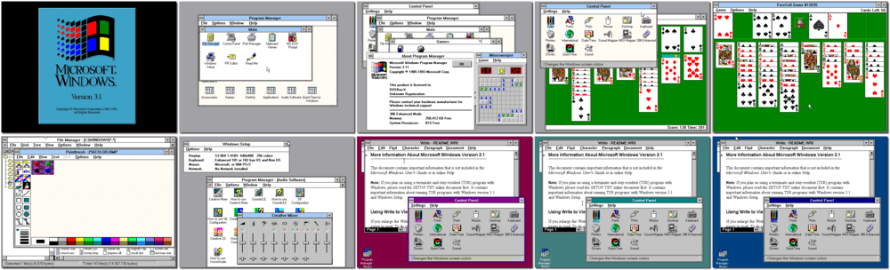

# Windows 3.1x

「**Microsoft Windows 3.11**」

> ❝ Windows 3.1 (codenamed Janus) is a series of 16-bit GUI operating environments for MS-DOS developed by Microsoft for use on personal computers. The series began with 'Windows 3.1' released on April 6, 1992, as a successor to 'Windows 3.0'. Support for all 16-bit versions of Windows ended on December 31, 2001. ❞
>
> ❝ It is generally okay to install and run old operating systems like Windows 3.1 for the purpose of playing nostalgic games, as long as you're not using it for any illegal or unethical activities. ❞ — *ChatGPT*
>

📌 ┃ **Year** ‣ 1993 ┃ **Type** ‣ Operating System ┃ **Platform** ‣ DOS ┃ **License** ‣ Discontinued ┃ **Media** ‣ CD-ROM ┃ **Add-on** ‣ S3 Graphics drivers • Sound Blaster drivers ┃ **Extras** ‣ QuickTime • Video for Windows • Win32s • WinG 

📦 ┃ **[DOSBox](https://www.dosbox.com/) 🟩** ┃ **[DOSBox Staging](https://dosbox-staging.github.io/) 🟩** ┃ **[DOSBox-X](https://dosbox-x.com/) 🟩** 

📎 ┃ **[Wikipedia](https://en.wikipedia.org/wiki/Windows_3.1x)** ┃ **[Fandom](https://microsoft.fandom.com/wiki/Windows_3.1)** ┃ **[Windows 3.1x in DOSBox-Staging](https://github.com/dosbox-staging/dosbox-staging/wiki/Windows-3.1x)** ┃ **[Windows 3.1x in DOSBox-X](https://dosbox-x.com/wiki/Guide%3AInstalling-Windows-3.1x)** ┃ **[SierraHelp - Graphics Drivers for Windows 3.1x 🔓](http://www.sierrahelp.com/Utilities/Emulators/DOSBox/3x_InstallGraphicsDrivers.html)** ┃ **[SierraHelp - Soundblaster 16 Drivers for Windows 3.1x 🔓](http://www.sierrahelp.com/Utilities/Emulators/DOSBox/3x_InstallSB.html)** 

## Installation Notes
- Step 1: Installing Windows 3.1x
  - To set up Windows now, press ENTER.
  - To use Express Setup, press ENTER.
  - Enter your name and confirm.
  - Click **Install** with *No Printer Attached* selected.
  - You can *run* or *skip* the tutorial.
  - Click **Return to MS-DOS**. *Do not reboot Windows!*
- Step 2: Installing display driver
  - Adjust *Display: VGA* setting.
  - Select the last option: **Other (Requires disk provided by a hardware manufacturer)**.
  - Replace `A:\` with `C:\S3`, and press ENTER.
  - Select the first option: **S3 ... 640x480 256 colours** and select **Accept the configuration shown above.**
  - Replace `A:\` with `C:\S3`, and press ENTER.
- Step 3: Installing sound driver
  - To install the Audio Software now, press ENTER.
  - Select **Full Installation**.
  - On the installation path: **Proceed using the settings shown**.
  - On settings: Adjust the *Interrupt setting*, change the value to **7** and **Proceed using the settings shown**.
  - Select **Backup** when prompted to replace files.
  - To exit DOS, press ENTER.
- The program will now quit. Please rerun the `Launch` script to start Windows 3.1x.

## Additional Notes
- Audio configuration:
  - Open **Main > Control Panel > MIDI Mapper**, change the *Name* dropdown to **SB16 All MIDI** and click **Close**.
  - Open **Main > Control Panel > Drivers**, add new **[MCI] CD Audio** driver to the list, replace `A:\` with `C:\WIN31`, click **OK**, and click **Close**.
- Install essential programs:
  - Open **Main > File Manager** and go to the `C:\APPS` directory. Double-click on each of these filenames listed:
    - `C:\APPS\QTIME\QT16.EXE` to install [QuickTime](https://en.wikipedia.org/wiki/QuickTime).
    - `C:\APPS\VFW\SETUP.EXE` to install [Video for Windows](https://en.wikipedia.org/wiki/Video_for_Windows).
    - `C:\APPS\WIN32S\SETUP.EXE` to install [Win32s](https://en.wikipedia.org/wiki/Win32s).
    - `C:\APPS\WING\SETUP.EXE` to install [WinG](https://en.wikipedia.org/wiki/WinG).
  - Remove the `C:\APPS` directory.
- Exit Windows and run the `Snapshot` script.

