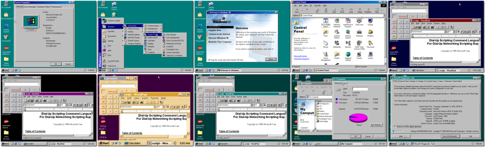

# Windows 98 Second Edition

「**Windows 98SE**」「**Microsoft Windows 98 Second Edition**」

> ❝ Windows 98 (codenamed Memphis) is a graphical operating system by Microsoft. It is the second major release in the Windows 9x line of operating systems. Released to manufacturing on May 15, 1998, and to retail on June 25, 1998, Microsoft planned to discontinue its support for Windows 98 versions on January 16, 2004. However, due to its popularity, Microsoft maintained support until July 11, 2006. Windows 98 is no longer available from Microsoft in any form due to the terms of Java-related settlements Microsoft made with Sun Microsystems. ❞
>
> ❝ Windows 98 was a discontinued and unsupported operating system by Microsoft. Running Windows 98 for the sole purpose of playing nostalgic games or for non-commercial, offline use is generally acceptable. ❞ — *ChatGPT*
>

📌 ┃ **Year** ‣ 1998 ┃ **Type** ‣ Operating System ┃ **License** ‣ Discontinued ┃ **Media** ‣ CD-ROM ┃ **Extras** ‣ 7-zip 9.2 • DirectX 9C 

📦 ┃ **[DOSBox](https://www.dosbox.com/) ⬜ • Untested** ┃ **[DOSBox Staging](https://dosbox-staging.github.io/) ⬜ • Untested** ┃ **[DOSBox-X](https://dosbox-x.com/) 🟩** 

📎 ┃ **[Wikipedia](https://en.wikipedia.org/wiki/Windows_98#Windows_98_Second_Edition)** ┃ **[Fandom](https://microsoft.fandom.com/wiki/Windows_98#Windows_98_Second_Edition)** ┃ **[Windows 98 in DOSBox-X](https://dosbox-x.com/wiki/Guide%3AInstalling-Windows-98)** ┃ **[Product Keys](https://forum.winworldpc.com/discussion/6677/new-serials-compilation)** 

## Installation Notes
- The screen will freeze on the DOSBox-X splash for a few minutes (creating a new 8GB hard disk image).
- To continue, press `ENTER`.
- To begin Setup, click **Continue**.
- Select **I accept the Agreement** and click **Next**.
- Enter a valid *Windows 98 Boxed Retail Install* product key and click **Next**.
- Select `C:\WINDOWS` and click **Next**.
- Select the **Typical** setup option and click **Next**.
- Enter a *name* and *company* information.
- Select **Install the most common components (Recommended)** and click **Next**.
- Confirm computer identification by clicking **Next**.
- Select your *country location* and click **Next**.
- Start copying files by clicking **Next**.
- The installation will take from 30 to 90 minutes, depending on the computer's speed.
- Select your *time zone*, click **Apply**, and click **OK**.
- Leave the account password field empty and click **OK**.

## Additional Notes
- Disable Task Scheduler
  - Open *My Computer > Scheduled Tasks*, click the *Advanced* tab on the menu top bar and click *Stop Using Task Scheduler*.
- Hard disk read-ahead optimization
  - Right-click *My Computer*. Select *Properties*. Click the *Performance* tab. Click *File System* in the *Advanced settings* section, click the *Hard Disk* tab, and set *Read-ahead optimization* to *None*.
  - Restart Windows if asked.
- Adjusting colors and screen size
  - Right-click on the desktop and select *Properties*. Click the *Settings* tab. Set **High Color (16 bit)** for colors and **640 by 480 pixels** for screen area. Click *Apply*.
  - Restart Windows if asked.
- Installing [7-zip](https://en.wikipedia.org/wiki/7-Zip).
  - Open *My Computer > C: > Temp*, double-click on `7z920.exe` file.
- Installing [DirectX](https://en.wikipedia.org/wiki/DirectX).
  - Open *My Computer > C: > Temp*, double-click on `dx9c.exe` file.
  - Location where you want to place the extracted files: Enter `C:\TEMP` and click **OK**.
  - Double-click on the extracted `DXSETUP.EXE` file.
    - Select **I accept the Agreement** and click **Next**.
    - Start installation by clicking **Next**.
    - Restart Windows if asked.
- Remove `C:\TEMP` directory and all its content.
- Exit Windows and run the `Snapshot` script.

---

