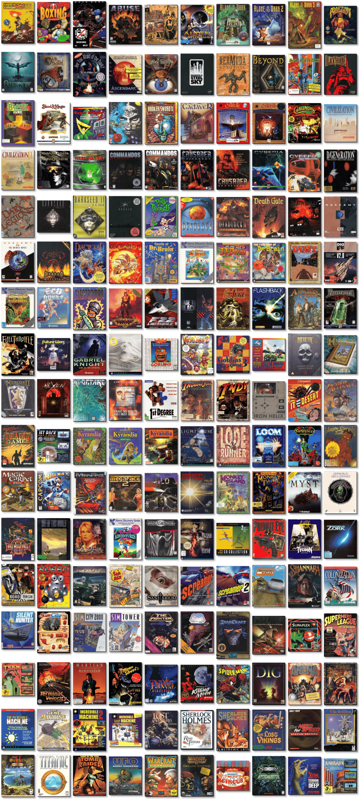

# Personal Library of Nostalgic Games

「**PLoNG**」

> ❝ PLoNG is an attempt to preserve the memory of my gaming youth. ❞
>

📌 ┃ **Script Version** ‣ 1.0.23.10d ┃ **Type** ‣ Library ┃ **Library Version** ‣ 23.10f ┃ **Library Name** ‣ PLoNG 

📦 ┃ **[DOSBox](https://www.dosbox.com/) 🟩** ┃ **[DOSBox Staging](https://dosbox-staging.github.io/) 🟩** ┃ **[DOSBox-X](https://dosbox-x.com/) 🟩** 

📎 ┃ **[Simple DOSBox Client](https://github.com/rarioj/sdc)** ┃ **Cover Arts** ‣ [MobyGames](https://www.mobygames.com/) ┃ **Program Assets** ‣ [Archive.org](https://archive.org/) 

## Getting Started
It is not necessary to clone or download the whole repository. This library uses [Simple DOSBox Client](https://github.com/rarioj/sdc) to process the `Library.txt` configuration file. Refer to SDC's [Host Requirements](https://github.com/rarioj/sdc#host-requirements) section for all the required and recommended tools. A [`Setup`](https://raw.githubusercontent.com/rarioj/sdc/main/Setup) script from SDC and a [`Library.txt`](https://raw.githubusercontent.com/rarioj/plong/main/Library.txt) configuration file from this repository are all you need. Steps to follow:

1. Create an empty library directory.
2. Download the latest `Library.txt` configuration file and the latest `Setup` script.
3. Make the `Setup` script executable.
4. Run the `Setup` script.

```shell
mkdir plong
cd plong
curl "https://raw.githubusercontent.com/rarioj/plong/main/Library.txt" -o Library.txt
curl "https://raw.githubusercontent.com/rarioj/sdc/main/Setup" -o Setup
chmod a+x Setup
./Setup
```

5. Once the library is ready, go to the desired game directory.
6. Run the `Launch` script and enjoy the game.

```shell
cd "Games/By Genre/Adventure/Beneath a Steel Sky"
./Launch
```

## Is this legal?
The purpose of this repository is to share a plain-text library configuration file. None of the program assets, such as floppy disks, CD-ROM images, zipped archives, and game manuals, are hosted here. I do not take any responsibility if downloading and running old programs (applications, tools, operating systems, and games) is considered illegal in certain countries. I do not condone the act of software piracy or copyright infringement.

Some of the old programs listed here are **Freeware** (free to use and distribute), **Abandonware** (no longer being distributed or supported by the developer or copyright holder), **Discontinued** (end-of-life software), and some are **Proprietary** (software is still available for purchase). Please try to buy the program first from [GOG](https://www.gog.com/), [Steam](https://store.steampowered.com/), or other online stores. Each program in the library, especially those tagged as *Proprietary*, will include external links to buy online.

All program assets are available from the [Internet Archive](https://archive.org/). It is possible, however, that some assets are no longer downloadable. Please submit an issue if that is the case.

> #### I asked [ChatGPT](https://chat.openai.com/) about the legality of playing old DOS games downloaded from the Internet Archive.
>
> ❝ The legality of playing old DOS games downloaded from Archive.org depends on the specific circumstances and the copyright status of the particular game in question.
>
> In general, it is illegal to download and play copyrighted material without the permission of the copyright owner. However, some older games, especially those made for MS-DOS, are now considered abandonware, which means that the copyright owner may no longer exist or may not be enforcing their rights to the game. In such cases, it may be legal to download and play the game.
>
> It's important to note that the legality of abandonware is a grey area, and there is no clear consensus on whether it is legal or not. If you're concerned about the legality of playing a specific game, you may want to consult a lawyer or do some research to determine the copyright status of the game.
>
> In general, it is a good idea to respect the rights of copyright owners and to only play games that you have legally obtained. ❞ — ChatGPT

&nbsp;

---

### ▶ **PLoNG**

#### 【17 Categories】
🗂️ ┃ [All Programs ‣ Games (190)](./All%20Programs/Games/README.md)┃ [All Programs ‣ Systems (2)](./All%20Programs/Systems/README.md)┃ [Games ‣ By Genre ‣ Action (58)](./Games/By%20Genre/Action/README.md)┃ [Games ‣ By Genre ‣ Adventure (70)](./Games/By%20Genre/Adventure/README.md)┃ [Games ‣ By Genre ‣ Educational (8)](./Games/By%20Genre/Educational/README.md)┃ [Games ‣ By Genre ‣ Puzzle (20)](./Games/By%20Genre/Puzzle/README.md)┃ [Games ‣ By Genre ‣ Racing (9)](./Games/By%20Genre/Racing/README.md)┃ [Games ‣ By Genre ‣ Role-playing (9)](./Games/By%20Genre/Role-playing/README.md)┃ [Games ‣ By Genre ‣ Simulation (14)](./Games/By%20Genre/Simulation/README.md)┃ [Games ‣ By Genre ‣ Sports (2)](./Games/By%20Genre/Sports/README.md)┃ [Games ‣ By Genre ‣ Strategy (37)](./Games/By%20Genre/Strategy/README.md)┃ [Games ‣ By License ‣ Abandonware (56)](./Games/By%20License/Abandonware/README.md)┃ [Games ‣ By License ‣ Freeware (27)](./Games/By%20License/Freeware/README.md)┃ [Games ‣ By License ‣ Proprietary (107)](./Games/By%20License/Proprietary/README.md)┃ [Games ‣ By Platform ‣ DOS (151)](./Games/By%20Platform/DOS/README.md)┃ [Games ‣ By Platform ‣ Windows 3.1x (25)](./Games/By%20Platform/Windows%203.1x/README.md)┃ [Games ‣ By Platform ‣ Windows 9x (14)](./Games/By%20Platform/Windows%209x/README.md)

#### 【192 Programs】
🔎 ┃ [3 Skulls of the Toltecs](./All%20Programs/Games/3%20Skulls%20of%20the%20Toltecs/README.md) ┃ [4D Boxing](./All%20Programs/Games/4D%20Boxing/README.md) ┃ [ABC Wide World of Sports Boxing](./All%20Programs/Games/ABC%20Wide%20World%20of%20Sports%20Boxing/README.md) ┃ [Abuse](./All%20Programs/Games/Abuse/README.md) ┃ [Age of Empires: Gold Edition](./All%20Programs/Games/Age%20of%20Empires/README.md) ┃ [Alien Carnage](./All%20Programs/Games/Alien%20Carnage/README.md) ┃ [Alone in the Dark](./All%20Programs/Games/Alone%20in%20the%20Dark/README.md) ┃ [Alone in the Dark 2](./All%20Programs/Games/Alone%20in%20the%20Dark%202/README.md) ┃ [Alone in the Dark 3](./All%20Programs/Games/Alone%20in%20the%20Dark%203/README.md) ┃ [Amazon: Guardians of Eden](./All%20Programs/Games/Amazon%20-%20Guardians%20of%20Eden/README.md) ┃ [An Elder Scrolls Legend: Battlespire](./All%20Programs/Games/An%20Elder%20Scrolls%20Legend%20-%20Battlespire/README.md) ┃ [Anvil of Dawn](./All%20Programs/Games/Anvil%20of%20Dawn/README.md) ┃ [Are You Afraid of the Dark? The Tale of Orpheo's Curse](./All%20Programs/Games/Are%20You%20Afraid%20of%20the%20Dark%3F%20The%20Tale%20of%20Orpheo%27s%20Curse/README.md) ┃ [Ascendancy](./All%20Programs/Games/Ascendancy/README.md) ┃ [Bad Mojo](./All%20Programs/Games/Bad%20Mojo/README.md) ┃ [Beneath a Steel Sky](./All%20Programs/Games/Beneath%20a%20Steel%20Sky/README.md) ┃ [Bermuda Syndrome](./All%20Programs/Games/Bermuda%20Syndrome/README.md) ┃ [Beyond Time](./All%20Programs/Games/Beyond%20Time/README.md) ┃ [Bio Menace](./All%20Programs/Games/Bio%20Menace/README.md) ┃ [Blackthorne](./All%20Programs/Games/Blackthorne/README.md) ┃ [Blockout](./All%20Programs/Games/Blockout/README.md) ┃ [Blood & Magic](./All%20Programs/Games/Blood%20%26%20Magic/README.md) ┃ [Boppin'](./All%20Programs/Games/Boppin%27/README.md) ┃ [Broken Sword: The Shadow of the Templars](./All%20Programs/Games/Broken%20Sword%20-%20The%20Shadow%20of%20the%20Templars/README.md) ┃ [Broken Sword II: The Smoking Mirror](./All%20Programs/Games/Broken%20Sword%20II%20-%20The%20Smoking%20Mirror/README.md) ┃ [Cadaver](./All%20Programs/Games/Cadaver/README.md) ┃ [Call of Cthulhu: Prisoner of Ice](./All%20Programs/Games/Call%20of%20Cthulhu%20-%20Prisoner%20of%20Ice/README.md) ┃ [Call of Cthulhu: Shadow of the Comet](./All%20Programs/Games/Call%20of%20Cthulhu%20-%20Shadow%20of%20the%20Comet/README.md) ┃ [Callahan's Crosstime Saloon](./All%20Programs/Games/Callahan%27s%20Crosstime%20Saloon/README.md) ┃ [Sid Meier's Civilization](./All%20Programs/Games/Civilization/README.md) ┃ [Sid Meier's Civilization II](./All%20Programs/Games/Civilization%20II/README.md) ┃ [Command & Conquer](./All%20Programs/Games/Command%20%26%20Conquer/README.md) ┃ [Command & Conquer: Red Alert](./All%20Programs/Games/Command%20%26%20Conquer%20-%20Red%20Alert/README.md) ┃ [Commandos: Behind Enemy Lines](./All%20Programs/Games/Commandos%20-%20Behind%20Enemy%20Lines/README.md) ┃ [Commandos: Beyond the Call of Duty](./All%20Programs/Games/Commandos%20-%20Beyond%20the%20Call%20of%20Duty/README.md) ┃ [Crusader: No Regret](./All%20Programs/Games/Crusader%20-%20No%20Regret/README.md) ┃ [Crusader: No Remorse](./All%20Programs/Games/Crusader%20-%20No%20Remorse/README.md) ┃ [Cyberia](./All%20Programs/Games/Cyberia/README.md) ┃ [Cyberia 2: Resurrection](./All%20Programs/Games/Cyberia%202%20-%20Resurrection/README.md) ┃ [D/Generation](./All%20Programs/Games/D-Generation/README.md) ┃ [Dark Legions](./All%20Programs/Games/Dark%20Legions/README.md) ┃ [Dark Seed](./All%20Programs/Games/Dark%20Seed/README.md) ┃ [Dark Seed II](./All%20Programs/Games/Dark%20Seed%20II/README.md) ┃ [Darker](./All%20Programs/Games/Darker/README.md) ┃ [Day of the Tentacle](./All%20Programs/Games/Day%20of%20the%20Tentacle/README.md) ┃ [Deadlock: Planetary Conquest](./All%20Programs/Games/Deadlock%20-%20Planetary%20Conquest/README.md) ┃ [Deadlock II: Shrine Wars](./All%20Programs/Games/Deadlock%20II%20-%20Shrine%20Wars/README.md) ┃ [Death Gate](./All%20Programs/Games/Death%20Gate/README.md) ┃ [Death Rally](./All%20Programs/Games/Death%20Rally/README.md) ┃ [Descent: Anniversary Edition](./All%20Programs/Games/Descent/README.md) ┃ [Descent II](./All%20Programs/Games/Descent%20II/README.md) ┃ [Desert Strike and Jungle Strike](./All%20Programs/Games/Desert%20Strike%20and%20Jungle%20Strike/README.md) ┃ [Diablo + Hellfire](./All%20Programs/Games/Diablo%20%2B%20Hellfire/README.md) ┃ [Discworld](./All%20Programs/Games/Discworld/README.md) ┃ [Discworld II: Missing presumed...!?](./All%20Programs/Games/Discworld%20II/README.md) ┃ [Castle of Dr. Brain](./All%20Programs/Games/Dr.%20Brain%20-%20Castle%20of%20Dr.%20Brain/README.md) ┃ [The Island of Dr. Brain](./All%20Programs/Games/Dr.%20Brain%20-%20The%20Island%20of%20Dr.%20Brain/README.md) ┃ [The Lost Mind of Dr. Brain](./All%20Programs/Games/Dr.%20Brain%20-%20The%20Lost%20Mind%20of%20Dr.%20Brain/README.md) ┃ [The Time Warp of Dr. Brain](./All%20Programs/Games/Dr.%20Brain%20-%20The%20Time%20Warp%20of%20Dr.%20Brain/README.md) ┃ [Dungeon Keeper: Gold Edition](./All%20Programs/Games/Dungeon%20Keeper/README.md) ┃ [Dust: A Tale of the Wired West](./All%20Programs/Games/Dust%20-%20A%20Tale%20of%20the%20Wired%20West/README.md) ┃ [EF 2000: V2.0](./All%20Programs/Games/EF%202000/README.md) ┃ [Earthworm Jim 1 & 2: The Whole Can 'O Worms](./All%20Programs/Games/Earthworm%20Jim%201%2B2/README.md) ┃ [Lost Secret of the Rainforest](./All%20Programs/Games/EcoQuest%20-%20Lost%20Secret%20of%20the%20Rainforest/README.md) ┃ [EcoQuest: The Search for Cetus](./All%20Programs/Games/EcoQuest%20-%20The%20Search%20for%20Cetus/README.md) ┃ [Electroman](./All%20Programs/Games/Electroman/README.md) ┃ [Emperor of the Fading Suns](./All%20Programs/Games/Emperor%20of%20the%20Fading%20Suns/README.md) ┃ [F-22 Lightning II](./All%20Programs/Games/F-22%20Lightning%20II/README.md) ┃ [Fade to Black](./All%20Programs/Games/Fade%20to%20Black/README.md) ┃ [Fallout](./All%20Programs/Games/Fallout/README.md) ┃ [Flashback](./All%20Programs/Games/Flashback/README.md) ┃ [Flight of the Amazon Queen](./All%20Programs/Games/Flight%20of%20the%20Amazon%20Queen/README.md) ┃ [Frankenstein: Through the Eyes of the Monster](./All%20Programs/Games/Frankenstein%20-%20Through%20the%20Eyes%20of%20the%20Monster/README.md) ┃ [Full Throttle](./All%20Programs/Games/Full%20Throttle/README.md) ┃ [Future Wars: Adventures in Time](./All%20Programs/Games/Future%20Wars%20-%20Adventures%20in%20Time/README.md) ┃ [Gabriel Knight: Sins of the Fathers](./All%20Programs/Games/Gabriel%20Knight%20-%20Sins%20of%20the%20Fathers/README.md) ┃ [Gabriel Knight 2: The Beast Within](./All%20Programs/Games/Gabriel%20Knight%202%20-%20The%20Beast%20Within/README.md) ┃ [Gobliiins](./All%20Programs/Games/Gobliiins/README.md) ┃ [Gobliins 2: The Prince Buffoon](./All%20Programs/Games/Gobliins%202%20-%20The%20Prince%20Buffoon/README.md) ┃ [Goblins Quest 3](./All%20Programs/Games/Goblins%20Quest%203/README.md) ┃ [God of Thunder](./All%20Programs/Games/God%20of%20Thunder/README.md) ┃ [Heretic: Shadow of the Serpent Riders](./All%20Programs/Games/Heretic/README.md) ┃ [Heroes of Might and Magic: A Strategic Quest](./All%20Programs/Games/Heroes%20of%20Might%20and%20Magic%20-%20A%20Strategic%20Quest/README.md) ┃ [Heroes of Might and Magic II: Gold](./All%20Programs/Games/Heroes%20of%20Might%20and%20Magic%20II/README.md) ┃ [Hexen: Beyond Heretic](./All%20Programs/Games/Hexen%20-%20Beyond%20Heretic/README.md) ┃ [Hi-Octane](./All%20Programs/Games/Hi-Octane/README.md) ┃ [I Have No Mouth, and I Must Scream](./All%20Programs/Games/I%20Have%20No%20Mouth%2C%20and%20I%20Must%20Scream/README.md) ┃ [In the 1st Degree](./All%20Programs/Games/In%20the%201st%20Degree/README.md) ┃ [Indiana Jones and the Fate of Atlantis](./All%20Programs/Games/Indiana%20Jones%20and%20the%20Fate%20of%20Atlantis/README.md) ┃ [Indiana Jones and the Last Crusade: The Graphic Adventure](./All%20Programs/Games/Indiana%20Jones%20and%20the%20Last%20Crusade%20-%20The%20Graphic%20Adventure/README.md) ┃ [Iron Helix](./All%20Programs/Games/Iron%20Helix/README.md) ┃ [It Came from the Desert](./All%20Programs/Games/It%20Came%20from%20the%20Desert/README.md) ┃ [Jagged Alliance](./All%20Programs/Games/Jagged%20Alliance/README.md) ┃ [Jagged Alliance: Deadly Games](./All%20Programs/Games/Jagged%20Alliance%20-%20Deadly%20Games/README.md) ┃ [Jetpack](./All%20Programs/Games/Jetpack/README.md) ┃ [The Legend of Kyrandia - Book One](./All%20Programs/Games/Legend%20of%20Kyrandia/README.md) ┃ [The Legend of Kyrandia - Book Two: Hand of Fate](./All%20Programs/Games/Legend%20of%20Kyrandia%202%20-%20Hand%20of%20fate/README.md) ┃ [The Legend of Kyrandia - Book Three: Malcolm's Revenge](./All%20Programs/Games/Legend%20of%20Kyrandia%203%20-%20Malcolm%27s%20Revenge/README.md) ┃ [Lighthouse: The Dark Being](./All%20Programs/Games/Lighthouse%20-%20The%20Dark%20Being/README.md) ┃ [Little Big Adventure](./All%20Programs/Games/Little%20Big%20Adventure/README.md) ┃ [Little Big Adventure 2](./All%20Programs/Games/Little%20Big%20Adventure%202/README.md) ┃ [Lode Runner: The Legend Returns](./All%20Programs/Games/Lode%20Runner%20-%20The%20Legend%20Returns/README.md) ┃ [Loom](./All%20Programs/Games/Loom/README.md) ┃ [Lure of the Temptress](./All%20Programs/Games/Lure%20of%20the%20Temptress/README.md) ┃ [Magic Carpet Plus](./All%20Programs/Games/Magic%20Carpet/README.md) ┃ [Magic Carpet 2: The Netherworlds](./All%20Programs/Games/Magic%20Carpet%202%20-%20The%20Netherworlds/README.md) ┃ [Mechanized Assault & Exploration](./All%20Programs/Games/Mechanized%20Assault%20%26%20Exploration/README.md) ┃ [Mechanized Assault & Exploration 2](./All%20Programs/Games/Mechanized%20Assault%20%26%20Exploration%202/README.md) ┃ [Mega Man X](./All%20Programs/Games/Mega%20Man%20X/README.md) ┃ [MegaRace](./All%20Programs/Games/MegaRace/README.md) ┃ [MegaRace 2](./All%20Programs/Games/MegaRace%202/README.md) ┃ [Milo](./All%20Programs/Games/Milo/README.md) ┃ [Mission Critical](./All%20Programs/Games/Mission%20Critical/README.md) ┃ [The Secret of Monkey Island](./All%20Programs/Games/Monkey%20Island%20-%20The%20Secret%20of%20Monkey%20Island/README.md) ┃ [Monkey Island 2: LeChuck's Revenge](./All%20Programs/Games/Monkey%20Island%202%20-%20LeChuck%27s%20Revenge/README.md) ┃ [Myst](./All%20Programs/Games/Myst/README.md) ┃ [Oddworld: Abe's Oddysee](./All%20Programs/Games/Oddworld%20-%20Abe%27s%20Oddysee/README.md) ┃ [One Must Fall: 2097](./All%20Programs/Games/One%20Must%20Fall%202097/README.md) ┃ [Out of This World](./All%20Programs/Games/Out%20of%20This%20World/README.md) ┃ [Panic in the Park](./All%20Programs/Games/Panic%20in%20the%20Park/README.md) ┃ [Pepper's Adventures in Time](./All%20Programs/Games/Pepper%27s%20Adventures%20in%20Time/README.md) ┃ [Phantasmagoria](./All%20Programs/Games/Phantasmagoria/README.md) ┃ [Phantasmagoria 2: A Puzzle of Flesh](./All%20Programs/Games/Phantasmagoria%202/README.md) ┃ [Prince of Persia CD Collection](./All%20Programs/Games/Prince%20of%20Persia%201%2B2/README.md) ┃ [Private Eye](./All%20Programs/Games/Private%20Eye/README.md) ┃ [Quake](./All%20Programs/Games/Quake/README.md) ┃ [Railroad Tycoon Deluxe](./All%20Programs/Games/Railroad%20Tycoon%20Deluxe/README.md) ┃ [Return of the Phantom](./All%20Programs/Games/Return%20of%20the%20Phantom/README.md) ┃ [Return to Zork](./All%20Programs/Games/Return%20to%20Zork/README.md) ┃ [Ringworld: Revenge of the Patriarch](./All%20Programs/Games/Ringworld%20-%20Revenge%20of%20the%20Patriarch/README.md) ┃ [Road Rash](./All%20Programs/Games/Road%20Rash/README.md) ┃ [Robbo](./All%20Programs/Games/Robbo/README.md) ┃ [RollerCoaster Tycoon: Gold Edition](./All%20Programs/Games/RollerCoaster%20Tycoon/README.md) ┃ [SPQR: The Empire's Darkest Hour](./All%20Programs/Games/SPQR%20-%20The%20Empire%27s%20Darkest%20Hour/README.md) ┃ [Sam & Max: Hit the Road](./All%20Programs/Games/Sam%20%26%20Max%20Hit%20the%20Road/README.md) ┃ [Sanitarium](./All%20Programs/Games/Sanitarium/README.md) ┃ [Screamer](./All%20Programs/Games/Screamer/README.md) ┃ [Screamer 2](./All%20Programs/Games/Screamer%202/README.md) ┃ [Screamer Rally](./All%20Programs/Games/Screamer%20Rally/README.md) ┃ [Shannara](./All%20Programs/Games/Shannara/README.md) ┃ [Sid Meier's Colonization](./All%20Programs/Games/Sid%20Meier%27s%20Colonization/README.md) ┃ [Silent Hunter](./All%20Programs/Games/Silent%20Hunter/README.md) ┃ [SimCity](./All%20Programs/Games/SimCity/README.md) ┃ [SimCity 2000: CD Collection](./All%20Programs/Games/SimCity%202000/README.md) ┃ [SimTower](./All%20Programs/Games/SimTower/README.md) ┃ [Spycraft: The Great Game](./All%20Programs/Games/Spycraft%20-%20The%20Great%20Game/README.md) ┃ [Star Wars: TIE Fighter - Collector's CD-ROM](./All%20Programs/Games/Star%20Wars%20-%20TIE%20Fighter/README.md) ┃ [Star Wars: X-Wing - Collector's CD-ROM](./All%20Programs/Games/Star%20Wars%20-%20X-Wing/README.md) ┃ [StarCraft: Anthology](./All%20Programs/Games/StarCraft/README.md) ┃ [Stargunner](./All%20Programs/Games/Stargunner/README.md) ┃ [Supaplex](./All%20Programs/Games/Supaplex/README.md) ┃ [Superhero League of Hoboken](./All%20Programs/Games/Superhero%20League%20of%20Hoboken/README.md) ┃ [Syndicate Plus](./All%20Programs/Games/Syndicate/README.md) ┃ [Syndicate Wars](./All%20Programs/Games/Syndicate%20Wars/README.md) ┃ [Teen Agent](./All%20Programs/Games/Teen%20Agent/README.md) ┃ [Terminal Velocity](./All%20Programs/Games/Terminal%20Velocity/README.md) ┃ [Tex Murphy: Martian Memorandum](./All%20Programs/Games/Tex%20Murphy%20-%20Martian%20Memorandum/README.md) ┃ [Tex Murphy: Mean Streets](./All%20Programs/Games/Tex%20Murphy%20-%20Mean%20Streets/README.md) ┃ [Tex Murphy: The Pandora Directive](./All%20Programs/Games/Tex%20Murphy%20-%20The%20Pandora%20Directive/README.md) ┃ [Tex Murphy: Under a Killing Moon](./All%20Programs/Games/Tex%20Murphy%20-%20Under%20a%20Killing%20Moon/README.md) ┃ [The 11th Hour](./All%20Programs/Games/The%2011th%20Hour/README.md) ┃ [The 7th Guest](./All%20Programs/Games/The%207th%20Guest/README.md) ┃ [The Amazing Spider-Man](./All%20Programs/Games/The%20Amazing%20Spider-Man/README.md) ┃ [The Dig](./All%20Programs/Games/The%20Dig/README.md) ┃ [The Elder Scrolls: Arena](./All%20Programs/Games/The%20Elder%20Scrolls%20-%20Arena/README.md) ┃ [The Elder Scrolls II: Daggerfall](./All%20Programs/Games/The%20Elder%20Scrolls%202%20-%20Daggerfall/README.md) ┃ [The Even More! Incredible Machine](./All%20Programs/Games/The%20Even%20More%20Incredible%20Machine/README.md) ┃ [The Gene Machine](./All%20Programs/Games/The%20Gene%20Machine/README.md) ┃ [The Incredible Machine 2](./All%20Programs/Games/The%20Incredible%20Machine%202/README.md) ┃ [The Incredible Toon Machine](./All%20Programs/Games/The%20Incredible%20Toon%20Machine/README.md) ┃ [The Lost Adventures of Legend](./All%20Programs/Games/The%20Lost%20Adventures%20of%20Legend/README.md) ┃ [The Lost Files of Sherlock Holmes: Case of the Rose Tattoo](./All%20Programs/Games/The%20Lost%20Files%20of%20Sherlock%20Holmes%20-%20The%20Case%20of%20the%20Rose%20Tattoo/README.md) ┃ [The Lost Files of Sherlock Holmes: The Case of the Serrated Scalpel](./All%20Programs/Games/The%20Lost%20Files%20of%20Sherlock%20Holmes%20-%20The%20Case%20of%20the%20Serrated%20Scalpel/README.md) ┃ [The Lost Vikings](./All%20Programs/Games/The%20Lost%20Vikings/README.md) ┃ [The Need for Speed: Special Edition](./All%20Programs/Games/The%20Need%20for%20Speed/README.md) ┃ [The Settlers](./All%20Programs/Games/The%20Settlers/README.md) ┃ [The Settlers II: Gold Edition](./All%20Programs/Games/The%20Settlers%20II/README.md) ┃ [Time Gate: Knight's Chase](./All%20Programs/Games/Time%20Gate%20-%20Knight%27s%20Chase/README.md) ┃ [Timelapse](./All%20Programs/Games/Timelapse/README.md) ┃ [Titanic: Adventure Out of Time](./All%20Programs/Games/Titanic%20-%20Adventure%20Out%20of%20Time/README.md) ┃ [Tomb Raider Gold](./All%20Programs/Games/Tomb%20Raider%20Gold/README.md) ┃ [UFO: Enemy Unknown](./All%20Programs/Games/UFO%20-%20Enemy%20Unknown/README.md) ┃ [War Wind](./All%20Programs/Games/War%20Wind/README.md) ┃ [Warcraft: Orcs & Humans](./All%20Programs/Games/Warcraft%20-%20Orcs%20%26%20Humans/README.md) ┃ [Warcraft II](./All%20Programs/Games/Warcraft%20II/README.md) ┃ [Where's Waldo? At the Circus](./All%20Programs/Games/Where%27s%20Waldo%3F%20At%20the%20Circus/README.md) ┃ [X-COM: Apocalypse](./All%20Programs/Games/X-COM%20-%20Apocalypse/README.md) ┃ [X-COM: Terror from the Deep](./All%20Programs/Games/X-COM%20-%20Terror%20from%20the%20Deep/README.md) ┃ [Xargon](./All%20Programs/Games/Xargon/README.md) ┃ [Z](./All%20Programs/Games/Z/README.md) ┃ [Windows 3.1x](./All%20Programs/Systems/Windows%203.1x/README.md) ┃ [Windows 98 Second Edition](./All%20Programs/Systems/Windows%2098SE/README.md) 



---

