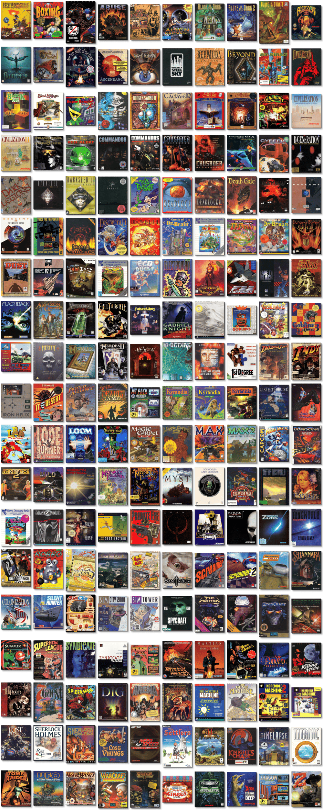

# Personal Library of Nostalgic Games

「**PLoNG**」

> ❝ PLoNG is an attempt to preserve the memory of my gaming youth. ❞
>

📌 ┃ Script Version: **1.0.23.7a** ┃ Type: **Library** ┃ Library Version: **23.7b** ┃ Library Name: **PLoNG** 

📦 ┃ **[DOSBox](https://www.dosbox.com/) 🟩** ┃ **[DOSBox Staging](https://dosbox-staging.github.io/) 🟩** ┃ **[DOSBox-X](https://dosbox-x.com/) 🟩** 

📎 ┃ **[Simple DOSBox Client](https://github.com/rarioj/sdc)** ┃ Cover Arts: **[MobyGames](https://www.mobygames.com/)** ┃ Program Assets: **[Archive.org](https://archive.org/)** 

## Getting Started
It is not necessary to clone or download the whole repository. This library uses [Simple DOSBox Client](https://github.com/rarioj/sdc) to process the `Library.txt` configuration file. Refer to SDC's [Host Requirements](https://github.com/rarioj/sdc#host-requirements) section for all the required and recommended tools. A [`Setup`](https://raw.githubusercontent.com/rarioj/sdc/main/Setup) script from SDC and a [`Library.txt`](https://raw.githubusercontent.com/rarioj/plong/main/Library.txt) configuration file from this repository are all you need. Steps to follow:

1. Create an empty library directory.
2. Download the latest `Library.txt` configuration file and the latest `Setup` script.
3. Make the `Setup` script executable.
4. Run the `Setup` script.

```shell
mkdir plong
cd plong
curl "https://raw.githubusercontent.com/rarioj/plong/main/Library.txt" -o Library.txt
curl "https://raw.githubusercontent.com/rarioj/sdc/main/Setup" -o Setup
chmod a+x Setup
./Setup
```

5. Once the library is ready, go to the desired game directory.
6. Run the `Launch` script and enjoy the game.

```shell
cd "Games/By Genre/Adventure/Beneath a Steel Sky"
./Launch
```

## Is this legal?
The purpose of this repository is to share a plain-text library configuration file. None of the program assets, such as floppy disks, CD-ROM images, zipped archives, and game manuals, are hosted here. I do not take any responsibility if downloading and running old programs (applications, tools, operating systems, and games) is considered illegal in certain countries. I do not condone the act of software piracy or copyright infringement.

Some of the old programs listed here are **Freeware** (free to use and distribute), **Abandonware** (no longer being distributed or supported by the developer or copyright holder), **Discontinued** (end-of-life software), and some are **Proprietary** (software is still available for purchase). Please try to buy the program first from [GOG](https://www.gog.com/), [Steam](https://store.steampowered.com/), or other online stores. Each program in the library, especially those tagged as *Proprietary*, will include external links to buy online.

All program assets are available from the [Internet Archive](https://archive.org/). It is possible, however, that some assets are no longer downloadable. Please submit an issue if that is the case. I asked [ChatGPT](https://chat.openai.com/) about the legality of playing old DOS games downloaded from the Internet Archive.

> ❝ The legality of playing old DOS games downloaded from Archive.org depends on the specific circumstances and the copyright status of the particular game in question.
>
> In general, it is illegal to download and play copyrighted material without the permission of the copyright owner. However, some older games, especially those made for MS-DOS, are now considered abandonware, which means that the copyright owner may no longer exist or may not be enforcing their rights to the game. In such cases, it may be legal to download and play the game.
>
> It's important to note that the legality of abandonware is a grey area, and there is no clear consensus on whether it is legal or not. If you're concerned about the legality of playing a specific game, you may want to consult a lawyer or do some research to determine the copyright status of the game.
>
> In general, it is a good idea to respect the rights of copyright owners and to only play games that you have legally obtained. ❞ — ChatGPT



> <table><tr><td width="50%">
>
> ### 🗄️ 15 Categories
> - 🗂️ [All Programs ‣ Games (80)](./All%20Programs/Games/README.md)
> - 🗂️ [All Programs ‣ Systems (1)](./All%20Programs/Systems/README.md)
> - 🗂️ [Games ‣ By Genre ‣ Action (29)](./Games/By%20Genre/Action/README.md)
> - 🗂️ [Games ‣ By Genre ‣ Adventure (19)](./Games/By%20Genre/Adventure/README.md)
> - 🗂️ [Games ‣ By Genre ‣ Puzzle (10)](./Games/By%20Genre/Puzzle/README.md)
> - 🗂️ [Games ‣ By Genre ‣ Racing (3)](./Games/By%20Genre/Racing/README.md)
> - 🗂️ [Games ‣ By Genre ‣ Role-playing (6)](./Games/By%20Genre/Role-playing/README.md)
> - 🗂️ [Games ‣ By Genre ‣ Simulation (6)](./Games/By%20Genre/Simulation/README.md)
> - 🗂️ [Games ‣ By Genre ‣ Sports (2)](./Games/By%20Genre/Sports/README.md)
> - 🗂️ [Games ‣ By Genre ‣ Strategy (20)](./Games/By%20Genre/Strategy/README.md)
> - 🗂️ [Games ‣ By License ‣ Abandonware (19)](./Games/By%20License/Abandonware/README.md)
> - 🗂️ [Games ‣ By License ‣ Freeware (27)](./Games/By%20License/Freeware/README.md)
> - 🗂️ [Games ‣ By License ‣ Proprietary (34)](./Games/By%20License/Proprietary/README.md)
> - 🗂️ [Games ‣ By Platform ‣ DOS (70)](./Games/By%20Platform/DOS/README.md)
> - 🗂️ [Games ‣ By Platform ‣ Windows 3.1x (10)](./Games/By%20Platform/Windows%203.1x/README.md)
>
> </td><td width="50%">
>
> ### 📓 81 Programs
> 🔎 ┃ [3 Skulls of the Toltecs](./All%20Programs/Games/3%20Skulls%20of%20the%20Toltecs/README.md) ┃ [4D Boxing](./All%20Programs/Games/4D%20Boxing/README.md) ┃ [ABC Wide World of Sports Boxing](./All%20Programs/Games/ABC%20Wide%20World%20of%20Sports%20Boxing/README.md) ┃ [Abuse](./All%20Programs/Games/Abuse/README.md) ┃ [Alien Carnage](./All%20Programs/Games/Alien%20Carnage/README.md) ┃ [Alone in the Dark](./All%20Programs/Games/Alone%20in%20the%20Dark/README.md) ┃ [Alone in the Dark 2](./All%20Programs/Games/Alone%20in%20the%20Dark%202/README.md) ┃ [Alone in the Dark 3](./All%20Programs/Games/Alone%20in%20the%20Dark%203/README.md) ┃ [Anvil of Dawn](./All%20Programs/Games/Anvil%20of%20Dawn/README.md) ┃ [Ascendancy](./All%20Programs/Games/Ascendancy/README.md) ┃ [Bad Mojo](./All%20Programs/Games/Bad%20Mojo/README.md) ┃ [Beneath a Steel Sky](./All%20Programs/Games/Beneath%20a%20Steel%20Sky/README.md) ┃ [Bermuda Syndrome](./All%20Programs/Games/Bermuda%20Syndrome/README.md) ┃ [Bio Menace](./All%20Programs/Games/Bio%20Menace/README.md) ┃ [Blackthorne](./All%20Programs/Games/Blackthorne/README.md) ┃ [Blockout](./All%20Programs/Games/Blockout/README.md) ┃ [Blood & Magic](./All%20Programs/Games/Blood%20%26%20Magic/README.md) ┃ [Boppin'](./All%20Programs/Games/Boppin%27/README.md) ┃ [Broken Sword: The Shadow of the Templars](./All%20Programs/Games/Broken%20Sword%20-%20The%20Shadow%20of%20the%20Templars/README.md) ┃ [Cadaver](./All%20Programs/Games/Cadaver/README.md) ┃ [Civilization](./All%20Programs/Games/Civilization/README.md) ┃ [Civilization II](./All%20Programs/Games/Civilization%20II/README.md) ┃ [Command & Conquer](./All%20Programs/Games/Command%20%26%20Conquer/README.md) ┃ [Command & Conquer: Red Alert](./All%20Programs/Games/Command%20%26%20Conquer%20-%20Red%20Alert/README.md) ┃ [D/Generation](./All%20Programs/Games/D-Generation/README.md) ┃ [Deadlock: Planetary Conquest](./All%20Programs/Games/Deadlock%20-%20Planetary%20Conquest/README.md) ┃ [Death Gate](./All%20Programs/Games/Death%20Gate/README.md) ┃ [Death Rally](./All%20Programs/Games/Death%20Rally/README.md) ┃ [Electroman](./All%20Programs/Games/Electroman/README.md) ┃ [Fade to Black](./All%20Programs/Games/Fade%20to%20Black/README.md) ┃ [Fallout](./All%20Programs/Games/Fallout/README.md) ┃ [Flashback](./All%20Programs/Games/Flashback/README.md) ┃ [Flight of the Amazon Queen](./All%20Programs/Games/Flight%20of%20the%20Amazon%20Queen/README.md) ┃ [Gabriel Knight: Sins of the Fathers](./All%20Programs/Games/Gabriel%20Knight%20-%20Sins%20of%20the%20Fathers/README.md) ┃ [Gabriel Knight 2: The Beast Within](./All%20Programs/Games/Gabriel%20Knight%202%20-%20The%20Beast%20Within/README.md) ┃ [God of Thunder](./All%20Programs/Games/God%20of%20Thunder/README.md) ┃ [Heroes of Might and Magic: A Strategic Quest](./All%20Programs/Games/Heroes%20of%20Might%20and%20Magic%20-%20A%20Strategic%20Quest/README.md) ┃ [Heroes of Might and Magic II: The Succession Wars](./All%20Programs/Games/Heroes%20of%20Might%20and%20Magic%20II%20-%20The%20Succession%20Wars/README.md) ┃ [Hi-Octane](./All%20Programs/Games/Hi-Octane/README.md) ┃ [I Have No Mouth, and I Must Scream](./All%20Programs/Games/I%20Have%20No%20Mouth%2C%20and%20I%20Must%20Scream/README.md) ┃ [Indiana Jones and the Fate of Atlantis](./All%20Programs/Games/Indiana%20Jones%20and%20the%20Fate%20of%20Atlantis/README.md) ┃ [Indiana Jones and the Last Crusade: The Graphic Adventure](./All%20Programs/Games/Indiana%20Jones%20and%20the%20Last%20Crusade%20-%20The%20Graphic%20Adventure/README.md) ┃ [It Came from the Desert](./All%20Programs/Games/It%20Came%20from%20the%20Desert/README.md) ┃ [Jagged Alliance](./All%20Programs/Games/Jagged%20Alliance/README.md) ┃ [Jagged Alliance: Deadly Games](./All%20Programs/Games/Jagged%20Alliance%20-%20Deadly%20Games/README.md) ┃ [Jetpack](./All%20Programs/Games/Jetpack/README.md) ┃ [Lode Runner: The Legend Returns](./All%20Programs/Games/Lode%20Runner%20-%20The%20Legend%20Returns/README.md) ┃ [Lure of the Temptress](./All%20Programs/Games/Lure%20of%20the%20Temptress/README.md) ┃ [The Secret of Monkey Island](./All%20Programs/Games/Monkey%20Island%20-%20The%20Secret%20of%20Monkey%20Island/README.md) ┃ [Monkey Island 2: LeChuck's Revenge](./All%20Programs/Games/Monkey%20Island%202%20-%20LeChuck%27s%20Revenge/README.md) ┃ [Oddworld: Abe's Oddysee](./All%20Programs/Games/Oddworld%20-%20Abe%27s%20Oddysee/README.md) ┃ [One Must Fall: 2097](./All%20Programs/Games/One%20Must%20Fall%202097/README.md) ┃ [Prince of Persia CD Collection](./All%20Programs/Games/Prince%20of%20Persia%20Collection/README.md) ┃ [Robbo](./All%20Programs/Games/Robbo/README.md) ┃ [SPQR: The Empire's Darkest Hour](./All%20Programs/Games/SPQR%20-%20The%20Empire%27s%20Darkest%20Hour/README.md) ┃ [SimCity](./All%20Programs/Games/SimCity/README.md) ┃ [SimCity 2000](./All%20Programs/Games/SimCity%202000%20-%20CD%20Collection/README.md) ┃ [SimTower](./All%20Programs/Games/SimTower/README.md) ┃ [Stargunner](./All%20Programs/Games/Stargunner/README.md) ┃ [Supaplex](./All%20Programs/Games/Supaplex/README.md) ┃ [Teen Agent](./All%20Programs/Games/Teen%20Agent/README.md) ┃ [Terminal Velocity](./All%20Programs/Games/Terminal%20Velocity/README.md) ┃ [The Amazing Spider-Man](./All%20Programs/Games/The%20Amazing%20Spider-Man/README.md) ┃ [The Dig](./All%20Programs/Games/The%20Dig/README.md) ┃ [The Elder Scrolls: Arena](./All%20Programs/Games/The%20Elder%20Scrolls%20-%20Arena/README.md) ┃ [The Elder Scrolls II: Daggerfall](./All%20Programs/Games/The%20Elder%20Scrolls%202%20-%20Daggerfall/README.md) ┃ [The Even More Incredible Machine](./All%20Programs/Games/The%20Even%20More%20Incredible%20Machine/README.md) ┃ [The Incredible Machine 2](./All%20Programs/Games/The%20Incredible%20Machine%202/README.md) ┃ [The Incredible Toon Machine](./All%20Programs/Games/The%20Incredible%20Toon%20Machine/README.md) ┃ [The Lost Vikings](./All%20Programs/Games/The%20Lost%20Vikings/README.md) ┃ [The Need for Speed: Special Edition](./All%20Programs/Games/The%20Need%20for%20Speed/README.md) ┃ [The Settlers](./All%20Programs/Games/The%20Settlers/README.md) ┃ [The Settlers II: Gold Edition](./All%20Programs/Games/The%20Settlers%20II%20-%20Gold%20Edition/README.md) ┃ [Titanic: Adventure Out of Time](./All%20Programs/Games/Titanic%20-%20Adventure%20Out%20of%20Time/README.md) ┃ [UFO: Enemy Unknown](./All%20Programs/Games/UFO%20-%20Enemy%20Unknown/README.md) ┃ [Warcraft: Orcs & Humans](./All%20Programs/Games/Warcraft%20-%20Orcs%20%26%20Humans/README.md) ┃ [Warcraft II: Battle Chest](./All%20Programs/Games/Warcraft%20II%20-%20Battle%20Chest/README.md) ┃ [X-COM: Apocalypse](./All%20Programs/Games/X-COM%20-%20Apocalypse/README.md) ┃ [X-COM: Terror from the Deep](./All%20Programs/Games/X-COM%20-%20Terror%20from%20the%20Deep/README.md) ┃ [Xargon](./All%20Programs/Games/Xargon/README.md) ┃ [Windows 3.1x](./All%20Programs/Systems/Windows%203.1x/README.md) 
> </td></tr></table>

&nbsp;

